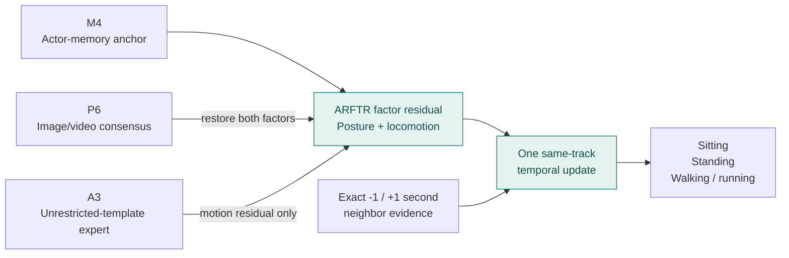
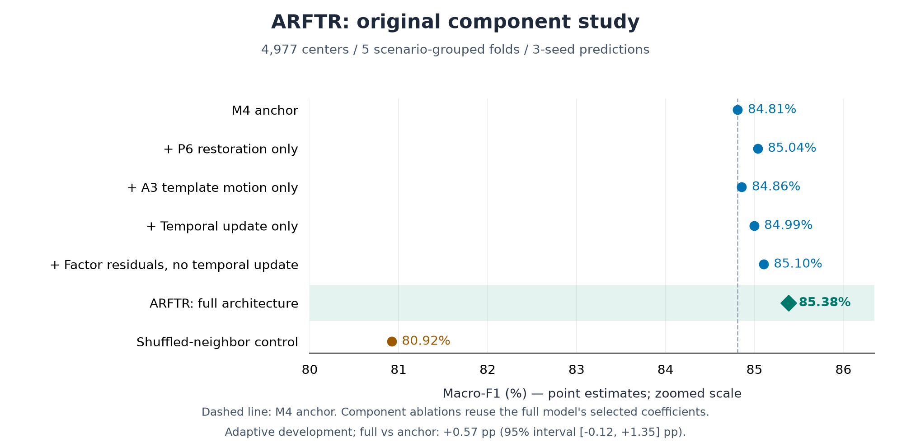

# ARFTR

**Anchor-Restored Factorized Temporal Residual for human activity classification**

[](https://github.com/abdullahuseyinli-dot/arftr/actions/workflows/ci.yml?query=branch%3Amain)
[](pyproject.toml)
[](LICENSE)

ARFTR is a research architecture for classifying a tracked person as **sitting**,
**standing**, or **walking/running**. It combines image/video evidence and actor
memory through separate posture and locomotion decisions, followed by a constrained
same-track temporal update.

The design centers on **anchor-based factor correction**: start with a strong
probability estimate, restore complementary posture and motion evidence, and restrict
the additional template expert's residual to locomotion.

| Retained macro-F1 | Accuracy | Evaluation |
| ---: | ---: | --- |
| **85.383648%** | **85.895118%** | 4,977 Okutama centers · 11 scenarios · 5 outer folds |

ARFTR makes **702 errors** on this cohort. These are adaptive internal-development
results, not an untouched confirmation test.

[Architecture](docs/ARCHITECTURE.md) · [Results and evidence](results/arftr_development/README.md) ·
[Technical report](docs/ARFTR_REPORT.md) · [PDF](output/pdf/arftr_report_v1.0.0.pdf) ·
[Model card](docs/MODEL_CARD.md) · [Reproduce](docs/REPRODUCIBILITY.md) ·
[Result highlights](docs/RESULTS.md)

## How ARFTR works

The fusion layer operates on upstream probabilities from frozen-encoder-based models.
It separates **sitting versus upright posture** from **standing versus locomotion**,
so each evidence source has an explicit role in the correction.



Four coefficients are selected using inner out-of-fold predictions **inside each
outer training fold**. Temporal links stay within the same track, recording,
scenario and fold. An all-zero correction preserves the original M4 probabilities
exactly. The fusion layer adds no new neural fits; upstream models supply three-seed
predictions. It uses supplied track metadata and can use future frames, so this is
an offline/look-ahead setup.

[Implementation](src/hac/arftr.py) · [Locked protocol](experiments/okutama_arftr_protocol.json) ·
[Equations and component definitions](docs/ARCHITECTURE.md)

## Results and component evidence

The original ARFTR study tested the anchor, individual correction components, their
combination, and a shuffled-neighbor control on the same evaluation population.



| Comparison | Observed change | Interpretation |
| --- | --- | --- |
| Matched M4 anchor → ARFTR | **84.811129% → 85.383648%**; 33 fewer errors | Original architecture comparison; NLL and Brier also improve |
| Early T2 system → retained ARFTR | **71.923768% → 85.383648%**; 710 fewer errors | Historical development gain of **+13.46 pp**, combining representation, source, memory and fusion changes |

The component ablations reuse the full model's selected coefficients. The incremental
gain over M4 is uncertain: its 95% scenario-bootstrap interval is **−0.12 to +1.35 pp**.
The larger T2-to-ARFTR gain is not the isolated effect of this fusion layer.
[Complete component results and statistical controls](docs/ARCHITECTURE.md#original-component-study).

Per-class scores and the confusion matrix are in the [model card](docs/MODEL_CARD.md).
ARFTR remains the retained system; subsequent extensions and their outcomes are
documented in the [research history](docs/RESEARCH_OVERVIEW.md).

## Inspect and reproduce

Verify the public result arithmetic, evidence hashes, figures and documentation
without a dataset, GPU or third-party Python packages:

```bash
python tools/check_project.py
```

For installation, synthetic tests and full-replay requirements, use the
[reproduction guide](docs/REPRODUCIBILITY.md). Model weights, source media and private
feature caches are not distributed; aggregate validation is not checkpoint replay.

| Resource | Contents |
| --- | --- |
| [Architecture guide](docs/ARCHITECTURE.md) | Design, equations, original ablations and source map |
| [Public evidence](results/arftr_development/README.md) | Component study, retained metrics, experiment ledger and knowledge graph |
| [Model card](docs/MODEL_CARD.md) | Inputs, per-class behavior, intended use and limitations |
| [Validation record](docs/VALIDATION.md) | Checkout checks, CI, preservation and reproducibility scope |

## Related work from this project

ARFTR grew out of earlier work on person-centric representations, image/video fusion,
and actor memory. The [development lineage](docs/HAC_EXPERIMENT_REVIEW_20260912.md)
traces those contributions. The earlier sealed temporal study achieved **78.54%
macro-F1**, with **78.17% at a 50% clip-use budget** on 1,771 separate confirmation
examples. These are earlier models, not a confirmation score for ARFTR.
[Temporal results and useful gains](docs/RESULTS.md).

The still-image work now has its own home:
[**POLAR Posture Recognition**](https://github.com/abdullahuseyinli-dot/polar-posture-recognition),
with an audited four-/nine-class benchmark covering DINOv2, DINOv3, SigLIP2 and
ConvNeXt V2, plus the original **93.99% four-class ensemble** and V-COCO transfer.
Its [current results](https://github.com/abdullahuseyinli-dot/polar-posture-recognition/blob/main/docs/RESULTS.md)
use different tasks and protocols; they are not ARFTR baselines.
Original reports and historical paths remain in the [research archive](docs/README.md#historical-studies)
to preserve reproducibility. [Project separation and version history](docs/PROJECT_HISTORY.md).

## Project information

Author: **Abdulla Huseyinli**. ARFTR project version **1.0.0**.
[Citation](CITATION.cff) · [MIT License](LICENSE) ·
[Third-party data/model terms](THIRD_PARTY_NOTICES.md) · [Contributing](CONTRIBUTING.md) ·
[Changelog](CHANGELOG.md) · [Documentation index](docs/README.md)
