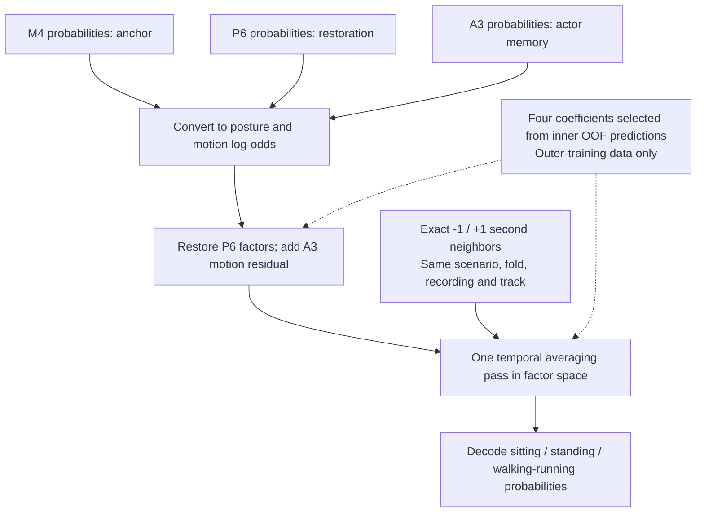
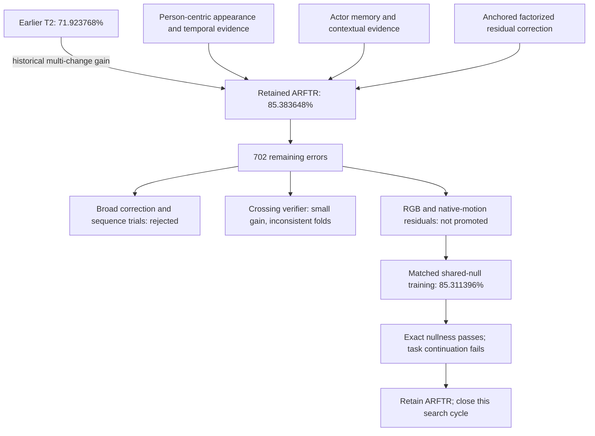

# Architecture and evidence map

This map summarizes the development line. It is not a claim that every stage's
gain was isolated by a matched ablation. Source and protocol references below are
the executable definitions.

## What ARFTR actually computes

ARFTR means **Anchor-Restored Factorized Temporal Residual**. It operates on
upstream probabilities rather than learning a new video encoder:

- **M4 anchor:** the selected new-source model supplies base probabilities.
- **P6 restoration:** bounded contributions restore posture and motion log-odds.
- **A3 residual:** actor-memory evidence contributes only to upright motion.
- **Temporal step:** factor scores use exact +/-1-second neighbors from the same
  scenario, fold, recording and track, then decode back to three probabilities.

Posture is sitting versus upright; motion is walking/running versus standing
conditional on being upright. Four coefficients are selected from a fixed
300-candidate set using inner out-of-fold predictions inside each outer training
fold. The ARFTR layer adds no neural fits; its upstream predictions include
three-seed refits. These details follow the
[retained protocol](../experiments/okutama_arftr_protocol.json) and
[implementation](../src/hac/arftr.py).



For posture log-odds `s` and conditional-motion log-odds `m`, the residual step is:

```text
s = s_M4 + a * (s_P6 - s_M4)
m = m_M4 + b * (m_P6 - m_M4) + c * (m_A3 - m_M4)
```

For each factor `z`, the temporal pass uses
`z_final = z + beta * (mean(valid_neighbor_z) - z)`; a row without a valid neighbor
is unchanged by that pass. Decode `p_sitting = sigmoid(s_final)`, then split the
remaining upright probability with `sigmoid(m_final)` into walking/running and
standing. All-zero coefficients return the original M4 probabilities byte-for-byte.
The protocol applies each arm per aligned upstream seed, then averages probabilities.

No class labels enter these inference functions. The recorded setup **does require
person/track metadata and may use future (+1 second) evidence**; it is not a tested
causal, zero-latency raw-video classifier. See the [model card](MODEL_CARD.md).

## Experimental knowledge map

The retained point estimate should not be overstated: the original architecture
review reports that ARFTR's last incremental gain did not pass its strict
scenario-significance screen. The full historical gain is a different comparison.



The [curated JSON knowledge graph](../results/arftr_development/knowledge_graph.json)
and [experiment ledger](../results/arftr_development/experiment_ledger.csv) connect
the public result nodes. The local full graph retains 793 nodes and 1,496 edges;
its digest is included in the public graph. The curated graph is not advertised
as the complete experimental history.

## Reading the implementation

| Responsibility | Implementation / contract |
| --- | --- |
| Retained factor residual | [arftr.py](../src/hac/arftr.py) |
| Actor evidence memory | [actor_evidence_memory.py](../src/hac/actor_evidence_memory.py) |
| Retained outer evaluation | [ARFTR runner](../experiments/run_okutama_arftr.py), [protocol](../experiments/okutama_arftr_protocol.json) |
| Motion input representation | [native_motion_data.py](../src/hac/native_motion_data.py) |
| Plain bounded motion residual / loss | [native_motion_innovation.py](../src/hac/native_motion_innovation.py) |
| Shared-null residual and exact retain | [motion_null_contrast.py](../src/hac/motion_null_contrast.py) |
| Final matched experimental contract | [motion-null protocol](../experiments/okutama_motion_null_contrast_protocol.json) |
| Saved-checkpoint replay | [layout-corrected auditor](../experiments/audit_okutama_motion_null_contrast_v2.py) |

## Engineering lessons

1. Improvements in reconstruction, tracking consistency, or calibration proxies
   are not automatically improvements in activity decisions.
2. Complementary information must produce more rescued errors than harmed correct
   predictions, consistently across outer groups.
3. A null invariant is an architectural property, not evidence of task utility.
4. Applying reference subtraction after training is a different experiment from
   training that contrast from initialization.
5. Floating-point layout is part of exact replay. Mathematical equivalence alone
   does not guarantee bit-identical GPU outputs.
6. Any future learned intervention policy must retain the original prediction as
   an available action and learn intervention decisions inside each outer fold.

See the [research overview](RESEARCH_OVERVIEW.md) for numerical qualifications and
the [model card](MODEL_CARD.md) for intended-use boundaries.
