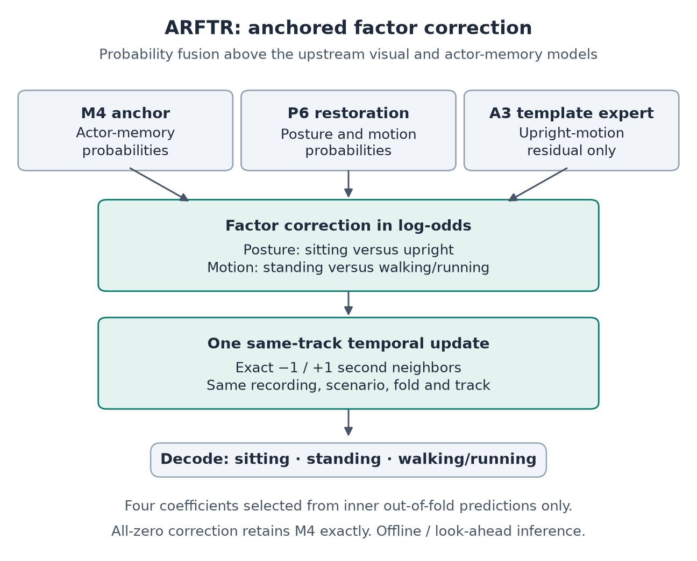
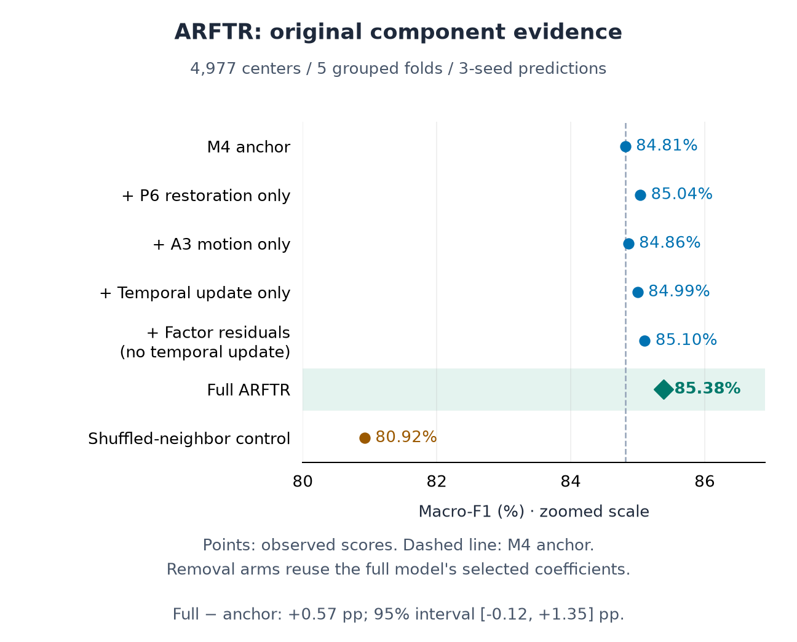

# ARFTR: Anchor-Restored Factorized Temporal Residual

## Abstract

ARFTR combines an actor-memory anchor, complementary image/video probabilities
and a template expert through posture and locomotion factors. A single same-track
temporal pass adds neighboring evidence before decoding three activity classes.
On 4,977 adaptively reused Okutama development centers, the retained system obtains
85.383648% macro-F1 and 85.895118% accuracy, with 702 errors. The matched anchor
reaches 84.811129% macro-F1; ARFTR rescues 98 errors and harms 65 correct predictions.
The +0.572519 percentage-point difference has a 95% scenario-bootstrap interval
of [−0.122986, +1.349570], so the component study does not establish statistically
significant superiority. This report describes the retained computation, original
seven-arm comparison and reproducibility boundary. It reports completed work,
not a new evaluation or an independent confirmation result.

## 1. Task and contribution

The task is person-centered classification into sitting, standing, and combined
walking/running. Evaluation uses supplied annotation-derived person boxes and track
identities. It is not an end-to-end detection/tracking benchmark. The development
population spans 11 Okutama scenarios, grouped into five outer folds; the same
population was repeatedly used during architecture research.

The contribution is a constrained fusion layer: restore complementary evidence
relative to a strong anchor, restrict one expert to the locomotion factor, and
use track correspondence in a single temporal update. Frozen visual representations,
actor-memory models and posture/motion factorization precede this layer; ARFTR
does not claim a new pretrained backbone or the invention of factorization itself.
The [architecture guide](https://github.com/abdullahuseyinli-dot/arftr/blob/main/docs/ARCHITECTURE.md)
links the upstream implementations and original protocol.

## 2. Factor-residual computation

Let M4 denote the selected actor-memory anchor, P6 the image/video/spatial
consensus, and A3 the unrestricted-template expert. For each probability vector,
posture log-odds distinguish sitting from upright activity; conditional-motion
log-odds distinguish walking/running from standing:

```text
s = log(p_sitting / (p_standing + p_walking_running))
m = log(p_walking_running / p_standing)

s_residual = s_M4 + a * (s_P6 - s_M4)
m_residual = m_M4 + b * (m_P6 - m_M4) + c * (m_A3 - m_M4)
```

Input probabilities are clipped to [1e-9, 1.0] before computing factors.
For either factor z, one pass applies
`z_final = z + beta * (mean(valid_neighbor_z) - z)`.
Neighbors must be exactly −1 or +1 second away (30 frames), with matching
scenario, outer fold, recording and track. A row with no valid neighbor receives
no temporal update. Sitting probability is sigmoid(s_final); the remaining upright
mass is split using sigmoid(m_final), with decoder logits clipped to [−30, 30].
All-zero coefficients take an explicit
identity path, preserving the original M4 probability bytes.

<!-- pagebreak -->



## 3. Selection and component controls

Four coefficients are chosen from a fixed 300-candidate grid using scenario-held
inner out-of-fold predictions inside each outer training fold. Selection orders
candidates by macro-F1, NLL, coefficient sum, then lexicographic coefficients.
The selected transformation is applied separately to aligned upstream seeds
42, 43 and 44; final probabilities are their arithmetic mean. ARFTR adds no new
neural fits, but this does not make upstream feature extraction or training free.

Seven original arms compare the exact M4 anchor, P6 restoration only, A3 motion
residual only, temporal update only, factor residuals without the temporal pass,
full ARFTR, and shuffled neighbors. Component-removal arms reuse the full model's
selected coefficients; they are not separately retuned. The shuffled control
preserves each row's neighbor count and samples within the same scenario, excluding
self and true neighbors. It tests correspondence in this recipe, not pure motion
independently of appearance.

The [locked protocol](https://github.com/abdullahuseyinli-dot/arftr/blob/main/experiments/okutama_arftr_protocol.json)
specifies selection, the seed aggregation, original success criteria and statistical
tests. Activity labels and diagnostic support categories do not enter the inference
functions. Future-frame evidence is permitted, making the evaluated system offline
or look-ahead rather than a validated causal streaming model. Upstream context can
extend beyond this layer's ±1-second neighborhood.

<!-- pagebreak -->

## 4. Original component results



| Matched system | Macro-F1 | Accuracy | Errors | NLL | Brier sum |
| --- | ---: | ---: | ---: | ---: | ---: |
| Exact M4 anchor | 84.811129% | 85.232068% | 735 | 0.390042 | 0.220730 |
| Full ARFTR | 85.383648% | 85.895118% | 702 | 0.377349 | 0.213505 |

The complete arm metrics, confusion matrices and statistical exports are available
in the [component evidence](https://github.com/abdullahuseyinli-dot/arftr/blob/main/results/arftr_development/architecture_study.json).
Full ARFTR makes 33 net corrections relative to M4: 98 rescues and 65 harms.
The marginal component scores should not be added to explain the full-model gain.

The paired macro-F1 interval uses 10,000 bootstrap resamples of the 11 scenarios.
Its [−0.122986, +1.349570] percentage-point range includes zero. The exact one-sided
scenario-swap test enumerates all 2,048 assignments and yields p = 0.064941,
above the original 0.05 threshold. The strict original screen did not pass in full.
Retention is a documented development decision, not established superiority or
an external state-of-the-art claim. Neither the interval nor scenario-grouped
cross-fitting removes adaptive-selection bias from repeated research use.

<!-- pagebreak -->

## 5. Error structure and development lineage


| Class | Examples | Precision | Recall | F1 |
| --- | ---: | ---: | ---: | ---: |
| Sitting | 734 | 82.47% | 84.60% | 83.52% |
| Standing | 2,118 | 83.91% | 83.95% | 83.93% |
| Walking / running | 2,125 | 89.12% | 88.28% | 88.70% |

Standing/walking-running confusion accounts for 457 of 702 errors (65.1%). This
locates the dominant error pair; it does not prove a motion-feature failure or
establish that all such examples are visually resolvable. Camera movement, small
actors, occlusion, pose ambiguity and label semantics remain possible explanations.

The earliest T2 system reached 71.923768% macro-F1 with 1,412 errors on the same
centers. The historical increase to ARFTR is +13.459880 points and 710 fewer errors.
It combines representation, source, memory and fusion changes; only the narrower
M4 comparison isolates the addition of the ARFTR layer to the matched anchor.
Earlier sealed temporal confirmation used different models and 1,771 separate
examples; its 78.54% score is not an ARFTR confirmation result.

Later correction and sequence trials did not establish a replacement. Some
exploratory point estimates were higher but inconsistent across folds. The final
matched paired-null motion residual reached 85.311396%, failed its fixed gates,
and was not promoted. The [research history](https://github.com/abdullahuseyinli-dot/arftr/blob/main/docs/RESEARCH_OVERVIEW.md)
preserves those outcomes; they do not imply a universal ceiling for future methods.

<!-- pagebreak -->

## 6. Reproducibility and scope

The public package provides code, locked protocols, aggregate component metrics,
confusion matrices, a selected 16-result ledger and a curated knowledge graph.
It does not redistribute dataset media, model weights or private feature caches.
The aggregate checker needs only Python's standard library:

```text
python tools/check_project.py
```

It recomputes confusion-based macro-F1, accuracy, per-class F1, errors and net
corrections, and checks evidence inventories, hashes, model-retention gates and
current presentation assets. NLL, Brier, rescue/harm overlap and scenario-based
intervals require original row predictions for full numerical replay; verifying
their export hashes is not equivalent to recomputing them.

On the research workstation, a separate preservation check covers protected
research files, original document snapshots, the final experiment and its locked
dependencies. Full model replay additionally requires compatible environments,
upstream models, data and ancestry-safe caches. Unit tests, public arithmetic checks
and saved-output replay are distinct from rerunning all upstream neural models.
The [reproduction guide](https://github.com/abdullahuseyinli-dot/arftr/blob/main/docs/REPRODUCIBILITY.md)
and [validation record](https://github.com/abdullahuseyinli-dot/arftr/blob/main/docs/VALIDATION.md)
state the checks performed and their limits.

## 7. Interpretation

The useful mechanism is explicit, anchor-relative control of complementary evidence:
P6 can restore both factors, A3 can alter only conditional locomotion, and temporal
correspondence is constrained before averaging. The shuffled-neighbor result and
matched rescue/harm evidence support this design as a development finding, with
the uncertainty stated above. They do not establish causality for each historical
gain, robustness to predicted tracks, or deployment performance.

The retained 85.38% development result is preserved. Stronger generalization claims
would require a frozen recipe and untouched scenarios or an external population.
No clinical, demographic-fairness or consequential individual-decision validation
has been performed. The [model card](https://github.com/abdullahuseyinli-dot/arftr/blob/main/docs/MODEL_CARD.md)
and [third-party notices](https://github.com/abdullahuseyinli-dot/arftr/blob/main/THIRD_PARTY_NOTICES.md)
document intended use and data/model terms.

## Evidence and implementation

- [ARFTR implementation](https://github.com/abdullahuseyinli-dot/arftr/blob/main/src/hac/arftr.py) and [evaluation runner](https://github.com/abdullahuseyinli-dot/arftr/blob/main/experiments/run_okutama_arftr.py).
- [Original component export and provenance](https://github.com/abdullahuseyinli-dot/arftr/blob/main/results/arftr_development/architecture_manifest.json).
- [Retained metrics and selected experimental lineage](https://github.com/abdullahuseyinli-dot/arftr/blob/main/results/arftr_development/README.md).
- [Earlier development review](https://github.com/abdullahuseyinli-dot/arftr/blob/main/docs/HAC_EXPERIMENT_REVIEW_20260912.md).

The current report summarizes existing evidence. Historical reports, numerical
exports and experiment protocols remain unchanged.
