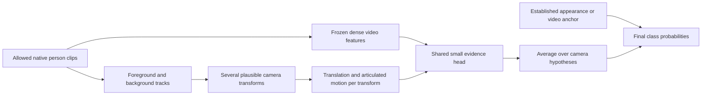

# Okutama next-phase research plan: targeting 82–85% macro-F1

Prepared 2026-09-07 from the completed continuation experiments, a new analysis of
the permitted OOF predictions, and a primary-literature search through this date.
This is a research design and prioritization document. It does not change historical
locks or authorize execution under their identities. No new model was trained for
this review. The new numerical analyses below are explicitly exploratory.

## Research decision

Prioritize **new visual and motion evidence**. Start with a frozen video encoder on
native person clips, then test a compact architecture that integrates body appearance,
articulated motion, and motion relative to the scene while accounting for ambiguity
in camera compensation.

82–85% means a gain of 10.08–13.08 percentage points over the latest 71.92% macro-F1.
It is a research target, not a forecast. The current errors contain enough numerical
room for that gain, but no existing experiment demonstrates that the missing
information can be recovered reliably. The first trial must establish that fact.

The prior BAVTR proposal remains a useful baseline-preservation design. A new
gate/sidecar using only the existing heads has insufficient demonstrated headroom for
this target. Its preservation mechanism can be used around genuinely new features.

V-COCO SVM convergence and legacy CPTR replay portability are separate maintenance
questions. They do not need to block a newly specified Okutama video/motion study.
V-COCO pose architecture is lower priority for the user's current Okutama target.

## 1. What the completed experiments establish

All Okutama numbers in this table refer to the existing provider-label three-class
task unless explicitly marked fixed validation. Percentage-point changes are
100 times the underlying macro-F1 differences.

| Experiment | Evidence | Interpretation for the next trial |
| --- | --- | --- |
| Static to temporal, fixed validation | 74.14% to 78.06% macro-F1 | Temporal observations can be useful; this is a historical validation comparison, not a new OOF gain. |
| Retained teacher to CPTR, grouped OOF | 71.65% to 71.44%; 96.5% of teacher errors remain shared | Added region/head complexity did not supply enough independent information. |
| T1 arithmetic pooling | 70.82% F1; NLL 0.7085 vs teacher 0.7539; cached-head p95 2.64 times faster | Useful probability-quality/efficiency signal; F1 and robustness failed. Calibration or useful confidence routing still requires direct validation. |
| T2 repeated versus distinct | 71.58% to 71.92%; +0.342 pp, interval [−0.055, +0.772] pp | Better sampling has a small positive development signal; it cannot explain a ten-point gain. |
| Historical camera compensation over raw box trajectory | +0.144 pp fixed-validation F1 | A better camera estimate alone has weak evidence. Dense articulated motion would be a materially different input. |
| Historical dual clocks | −0.716 pp fixed-validation F1 | More context is not automatically helpful; duration must be isolated. |
| Historical original/refined counterfactual objective | −2.449/−0.810 pp | Do not impose arbitrary class targets after destroying motion. Restrict training invariance to transformations that preserve the label. |
| Masked feature pretraining / GroupDRO / top-block LoRA | −0.624/−0.234/−3.018 pp in their respective historical screens | No support for another large tuning sweep on the same inputs. These were different historical conditions, not a controlled ranking of algorithms. |
| V-COCO mixed representations | +0.971 pp for simple mixed linear versus DINO flat; full stack +1.534 pp | Complementary representations helped elsewhere; this motivates testing video features, but supplies no Okutama effect-size estimate. |
| R1 replay / V0 SVM | Numerical reproduction failure / iteration-ceiling failure | These are execution failures, not evidence that all residual models or SVMs are ineffective. |

Sources: [completed execution report](HAC_CONTINUATION_EXECUTION_REPORT_20260907.md),
[engineering review](HAC_ENGINEERING_RESEARCH_REVIEW_20260906.md),
[historical temporal development metrics](../results/vcoco_v3/temporal_development_metrics.csv).
POLAR's historical 93.99% macro-F1 concerns another dataset and evaluation; it is not
the starting score or comparator for this plan.

## 2. New error-budget and correlation analysis

The analysis uses only the authorized 4,977-row temporal ensemble prediction export
and its summary. It preserves labels, scenario membership, and every original
prediction. All oracle constructions below use true labels and are explanatory
limits, never deployable estimators or candidate-selection rules.

The current distinct-frame confusion matrix is:

| True class / predicted class | Sitting | Standing | Walking/running |
| --- | ---: | ---: | ---: |
| Sitting | 571 | 84 | 79 |
| Standing | 159 | 1,319 | 640 |
| Walking/running | 84 | 366 | 1,675 |

There are 1,412 errors. Standing-to-locomotion and locomotion-to-standing account for
1,006, or **71.25% of all mistakes**. Sitting F1 is 73.77%, standing 67.87%, and
locomotion 74.13%. Distinguishing standing from locomotion is the largest error
opportunity, although posture errors also matter because macro-F1 weights classes
equally.

| New diagnostic | Exact result | Consequence |
| --- | ---: | --- |
| Wrong for every one of teacher, pooling, repeated and distinct heads | 1,205 rows; 85.34% of distinct-head errors | Current heads mostly fail on the same examples. |
| Perfect choice among all four existing hard predictions | Maximum macro-F1 **76.1625%**; maximum accuracy **75.7886%** | A router choosing these labels cannot reach 82%. This does not bound new heads, retraining, or arbitrary probability fusion. |
| Correct every occluded-window error; preserve everything else | **75.2848%** global macro-F1 | Occlusion repair alone is insufficient for 82%. |
| Correct every transition-window error; preserve everything else | **75.3397%** global macro-F1 | Transition repair alone is insufficient. These strata overlap; their gains cannot be added. |
| Repair only errors in the union of transition and occlusion windows | **At most 78.7062%** global macro-F1 | A loose upper bound obtained by summing per-cell repair counts; the unknown overlap can only reduce it. Even both specialties together cannot reach 82% under zero harm elsewhere. |
| Clear-window errors | 1,269/1,412 = 89.87% | The next method must also improve clear observations. |
| Non-transition errors | 1,237/1,412 = 87.61% | Stable-state recognition is central. |
| Error-indicator Pearson correlation, repeated versus distinct | 0.8966 | Sampling changes leave strongly related mistakes. |
| Scenario macro-F1 correlation, repeated versus distinct | 0.9967 over 11 scenarios | Scenario difficulty persists almost unchanged across these heads. |
| Scenario macro-F1 correlation, pooling versus distinct | 0.9550 over 11 scenarios | The shared scenario pattern extends to the simpler head. |
| Untuned equal probability mixture, pooling + distinct | 71.9416% macro-F1 | Post hoc descriptive result: only +0.0178 pp; no tuning or promotion. |

The exact 76.1625% hard-selection bound was found by assigning the correct class
whenever any model offered it, then optimizing the available wrong-class choices on
the remaining rows. Only 25/28/12 common-error rows, grouped by true class, permit
both wrong alternatives; exhaustive enumeration has 9,802 allocations. Correcting a
wrong prediction weakly improves all affected class F1 scores, so choosing available
correct labels is valid for this bound. This is a bound on selecting existing argmax
labels, not an information-theoretic bound on their features.

The exhaustive calculation agrees with the convex-box vertex maximum. Nine small
synthetic cases also match direct per-row brute-force selection. The script verifies
the expected source hashes before decoding arrays, reproduces the recorded metrics,
and records its own hash and runtime versions. Its focused checks and Ruff pass.

The correlations are descriptive. Shared examples and scenario difficulty induce
correlation; 11 scenarios do not support confident causal claims or a large
multivariable regression. The older class-standardized occlusion association remains
useful as a guardrail, but these new counts change its priority as the main route to a
large aggregate gain.

Confidence-only routing is also not a demonstrated solution: the distinct head makes
206 errors among 1,741 predictions with maximum probability at least 0.9. Scenario
macro-F1 ranges from 40.78% to 82.36%; the low-scoring scenario has only five sitting
examples, so class support and false positives complicate a pure domain-shift story.

### How much correction does 82–85 require?

For an interpretable thought experiment, reduce each selected off-diagonal confusion
cell by the same fraction and move those cases to the correct diagonal, introducing
no new errors. Fractional counts interpolate the observed matrix; they are not an
estimate of achievable performance or a minimum-error theorem.

| Assumed correction pattern | To reach 82% macro-F1 | To reach 85% macro-F1 |
| --- | ---: | ---: |
| Proportional correction across all error types | About **507** errors; **35.9%** of existing mistakes | About **658**; **46.6%** |
| Proportional correction only of standing↔locomotion | About **627**; **62.4%** of that boundary's errors | About **816**; **81.1%** |

Perfect correction of that motion boundary alone would give 88.03% macro-F1 while
leaving sitting-related mistakes unchanged. This identifies a potentially sufficient
error category; it does not establish that camera compensation, motion tracking, or a
video encoder can resolve it. Any new errors introduced increase the repair burden.

Artifacts: [analysis JSON](../.runs/research_20260907/next_phase_analysis/error_budget_analysis.json),
[reproduction script](../.runs/research_20260907/next_phase_analysis/error_budget_analysis.py),
[PNG](../.runs/research_20260907/next_phase_analysis/error_budget_analysis.png),
[PDF](../.runs/research_20260907/next_phase_analysis/error_budget_analysis.pdf).

## 3. What the literature changes

The search prioritized primary papers, author projects, and official repositories.
It includes classical motion work, video pretraining, aerial recognition, and recent
2026 methods. The following table records the decision-relevant findings; published
benchmark scores are not predictions for this three-class scenario-held-out task.

| Primary work | Relevant finding or mechanism | Design decision |
| --- | --- | --- |
| [Recognizing Action at a Distance, 2003](https://people.eecs.berkeley.edu/~efros/research/action/) | Stabilized small people and robust aggregated optical-flow descriptors support action recognition at low spatial resolution. | Test native motion before depending on accurate body keypoints. |
| [Moving-camera particle-trajectory decomposition, 2011](https://www.crcv.ucf.edu/action-recognition-in-videos-acquired-by-a-moving-camera-using-motion-decomposition-of-lagrangian-particle-trajectories/) | Separates camera-induced and object-induced trajectories; includes aerial evaluations. | Motion decomposition itself is established prior work. |
| [Improved Trajectories, ICCV 2013](https://openaccess.thecvf.com/content_iccv_2013/html/Wang_Action_Recognition_with_2013_ICCV_paper.html) | Background matches and human exclusions support homography-based motion compensation. | Include an inexpensive compensated-flow control. |
| [MS-TCN, CVPR 2019](https://openaccess.thecvf.com/content_CVPR_2019/papers/Abu_Farha_MS-TCN_Multi-Stage_Temporal_Convolutional_Network_for_Action_Segmentation_CVPR_2019_paper.pdf) | Dilated convolutions and refinement exploit action continuity. | Optional temporal smoothing control; watch transition damage and offline context. |
| [Long-Term Feature Banks, CVPR 2019](https://openaccess.thecvf.com/content_CVPR_2019/papers/Wu_Long-Term_Feature_Banks_for_Detailed_Video_Understanding_CVPR_2019_paper.pdf) | Cached long-range context can support detailed action understanding. | Isolate duration and inference lookahead; longer context is a separate factor. |
| [TinyVIRAT, 2020/2021](https://arxiv.org/abs/2007.07355) | Real surveillance clips expose low-resolution action difficulties; enhancement is studied with task supervision. | A possible later external domain, subject to ontology/rights review. Generative enhancement is not our first trial. |
| [VideoMAE, NeurIPS 2022](https://arxiv.org/abs/2203.12602) | Strongly masked video reconstruction learns tubelet representations. | Establish a video-pretrained comparison beyond per-frame image embeddings. |
| [VideoMAE V2, CVPR 2023](https://arxiv.org/abs/2303.16727) | Dual masking and progressive pretraining support scalable video representations and smaller distilled models. | Practical 16-frame/224px fallback encoder. |
| [MITFAS, WACV 2024](https://arxiv.org/html/2303.02575v2) | Aerial pixel alignment and sampling improve action features. The full UAV-Human comparison over bbox tracking improves 47.4 to 50.8 top-1. | Alignment matters, but the larger gains over unaligned inputs must not be extrapolated to our already cropped baseline. |
| [Drone-HAT, CVPRW 2024](https://openaccess.thecvf.com/content/CVPR2024W/ABAW/html/Khan_Drone-HAT_Hybrid_Attention_Transformer_for_Complex_Action_Recognition_in_Drone_CVPRW_2024_paper.html) | Multi-scale/granularity processing targets small aerial actors and multi-label recognition on Okutama. | Person-scale visual processing is relevant; its detection/multi-label endpoint differs from ours. |
| [VideoPrism, ICML 2024](https://arxiv.org/abs/2402.13217) | Video-text and video-focused self-supervision create useful frozen video features. | A frozen encoder plus small probe is a serious baseline, not merely a resource shortcut. |
| [InternVideo2, ECCV 2024](https://arxiv.org/abs/2403.15377) | Progressive video/multimodal training and distillation offer another representation family. | Reserve if the first encoder offers little complementarity; avoid a large model sweep. |
| [Trajectory-aligned Space-time Tokens, ECCV 2024](https://arxiv.org/abs/2407.18249) | Point trajectories align appearance and motion tokens. | Mandatory conceptual control against claiming tracks-plus-appearance as new. |
| [Taylor Videos, ICML 2024](https://proceedings.mlr.press/v235/wang24ck.html) | Temporal differences and higher-order terms emphasize motion. | An inexpensive motion representation alternative if point tracking is unreliable; camera contamination still needs testing. |
| [V-JEPA 2, 2025](https://arxiv.org/abs/2506.09985) | Latent video prediction supports frozen motion-understanding probes. | Compare genuinely temporal features with static-frame repetition through the same encoder. |
| [CoTracker3, ICCV 2025](https://arxiv.org/abs/2410.11831) | Joint point tracking with visibility/confidence and real-video pseudo-label training. | Frozen sparse tracking extractor; confidence is not automatically calibrated on tiny aerial people. |
| [Trokens, ICCV 2025](https://openaccess.thecvf.com/content/ICCV2025/html/Kumar_Trokens_Semantic-Aware_Relational_Trajectory_Tokens_for_Few-Shot_Action_Recognition_ICCV_2025_paper.html) | Semantic point selection plus intra/inter-trajectory motion and appearance. | Closest practical modern motion comparator; trajectory tokens alone do not establish novelty. |
| [DINOv3, 2025](https://arxiv.org/abs/2508.10104) | Gram anchoring preserves dense spatial representations. | A possible stronger image-feature control; image pretraining still does not directly learn video dynamics. |
| [V-JEPA 2.1, 2026](https://arxiv.org/abs/2603.14482) | Dense predictive and deep self-supervision improve spatially grounded, temporally consistent features. | First-priority frozen video encoder, with a released small model. |
| [TrajTok, CVPR 2026](https://arxiv.org/abs/2602.22779) | Learns trajectory tokens and offers a pretrained-feature probing formulation. | Learning trajectories and attaching a probe are also established; the proposed operator needs a stronger distinction. |
| [InternVideo-Next, CVPR 2026](https://arxiv.org/abs/2512.01342) | Detail-preserving latent learning followed by prediction addresses shortcuts in video pretraining. | Further reason to test whether a video backbone actually uses motion rather than assume it. |

The inspected [V-JEPA official release](https://github.com/facebookresearch/vjepa2)
provides V-JEPA 2.1 ViT-B/16, 80M parameters, 384px. Use the encoder alone; the official
loader also constructs a predictor. Its memory use on this machine has not been
measured. The [VideoMAE V2 model zoo](https://github.com/OpenGVLab/VideoMAEv2/blob/master/docs/MODEL_ZOO.md)
provides a 16-frame/224px distilled ViT-B checkpoint. Its K710 supervision must be
disclosed. Model selection between them begins with a label-independent compatibility
and resource test, with any fallback declared before measuring target performance.
The V-JEPA loader defaults to 64 frames at 384px. The proposed 16-frame extraction is
a declared transfer configuration, not a reproduction of its published evaluation;
verify temporal-position handling and record the exact loader arguments.

[CoTracker](https://github.com/facebookresearch/co-tracker),
[TATS](https://github.com/pulkitkumar95/tats), and
[Trokens](https://github.com/pulkitkumar95/trokens) have public implementations.
The inspected [MITFAS repository](https://github.com/Ricky-Xian/MITFAS) still says
"Coming Soon!"; its alignment mechanism would require a documented reimplementation.
VideoPrism's [official implementation](https://github.com/google-deepmind/videoprism)
uses JAX/Flax, adding integration work relative to the present PyTorch environment.
Exact commits, checkpoint bytes, terms, and available pretraining-corpus provenance
must be recorded before any new extraction. Public availability does not prove absence
of pretraining overlap with Okutama videos.

## 4. Proposed architecture: motion evidence under camera uncertainty

Working research question: **Can a classifier distinguish standing from locomotion
more reliably by separating body articulation from actor translation and averaging
class evidence over plausible camera-motion explanations?**

The proposed method combines three observations:

1. **Body appearance and articulation:** frozen dense video features from a person
   tube retain local changes through time. Use native crops, explicit crop transforms,
   and actual time offsets. Avoid collapsing the entire clip to one token before the
   small head can compare regions and times.
2. **Motion relative to the scene:** foreground point displacements measured relative
   to background motion preserve translation that person-centred crops can suppress.
   Normalize by actor scale and elapsed time. The old model already has box geometry;
   the new information is pixel correspondence and articulated movement, not merely a
   re-encoding of box centers.
3. **Ambiguity in observation:** visibility, cycle error, background support, and
   disagreement among camera fits determine whether the motion evidence is stable.
   This targets noisy nuisance estimation without assuming provider occlusion labels
   are available at deployment.



Let `x(t,i)` be an image-coordinate foreground point. Estimate `H_k(t→0)` from
background tracks outside all known actor boxes, with `k=1..4` a fixed ensemble of
camera fits formed by a declared spatial bootstrap. Each transform yields
`q_k(t,i)=project(H_k(t→0), x(t,i))`. Obtain robust actor translation from the common
displacement of reliable foreground points and articulation from deviations around
that common movement. Retain both channels: subtracting actor translation from every
channel would erase precisely the locomotion evidence we seek.

Restore foreground crop tracks to image coordinates **before** compensation:
`x_image(t)=inverse(C_t) x_crop(t)`, where `C_t` includes the actual crop, resize and
padding transform. If camera fitting uses downsampled scene coordinates `S_t`, use
`H_image(t→0)=inverse(S_0) H_downsampled(t→0) S_t`. Bootstrap track identities or
spatial blocks consistently across the whole clip, not independently at each time;
otherwise the hypotheses can invent camera acceleration. Preserve timestamp and
valid-padding masks throughout.
Estimate common actor displacement from the same surviving track identities across
adjacent frames, not from changes in the median position of whichever points happen
to be visible. Changing visible subsets can otherwise fabricate movement. Compare
fixed-canvas and dynamic-crop tracking in the quality diagnostic.

This is image-plane, background-relative motion, not metric ground speed. Homography
approximations can fail under parallax, depth variation, or poor texture. The ensemble
initially measures sensitivity to camera estimation; it is not a calibrated posterior.

For each factorized output head `h` and camera hypothesis `k`, a shared module predicts
a bounded residual `r(h,k)` from video tokens, the two motion channels, and observation
quality. Combine the resulting *class probabilities*, not hard decisions:

```text
if no valid new evidence:
    return the anchor probability vector exactly

z(h,k) = z_anchor(h) + g(h,k) * r(h,k)
p_k    = decode_factorized(z(posture,k), z(motion,k))
p      = sum_k w_k * p_k
```

Define `s=sigmoid(z(posture,k))` and `m=sigmoid(z(motion,k))`, with decoding
`[p_sitting,p_standing,p_locomotion]=[s,(1-s)*(1-m),(1-s)*m]`.
For an anchor probability vector, the corresponding factors are `s=p_sitting` and
`m=p_locomotion/(p_standing+p_locomotion)` when that denominator is nonzero.
Prefer native anchor logits; otherwise declare the numerical clipping used for logit
conversion and verify zero-residual reconstruction to the frozen tolerance. Hard
fallback returns the original probabilities without conversion. Compare against a
standard three-way simple probe too, so factorization is not an assumed advantage.
Under this hierarchy, motion supervision is conditional on non-sitting examples;
it must not assign a separate standing/moving target to sitting. Keep the decoder and
loss identical in A4/A5/A6, or test their difference as an explicit extra factor.

The initial `w_k` are uniform over valid camera hypotheses. A training-only calibration
model may later set weights, as a separately tested factor. Gates stay in [0,1];
residual outputs initialize to zero while gates initialize nonzero to allow gradients.
The missing-evidence branch must return the anchor directly, including when invalid
features contain NaNs; multiplication by zero is insufficient. Camera-derived weights
use no action labels or held-scenario outcomes at inference.
If video features are valid but all camera fits fail, return the video anchor; invalid
tracking must not erase the benefit of the independent video branch or remove a row.

The anchor is not sacred if a simple frozen-video model is much better: use the
strongest fairly selected simple model as the anchor. A direct unconstrained fusion
head is also a required control so preservation constraints do not impose an
unexamined performance ceiling.

### Candidate contribution and novelty boundary

The potential contribution is the explicit treatment of **camera-reference ambiguity
as uncertainty in class evidence**, separately for posture and motion, with tests that
distinguish genuine actor-motion reliance from camera or background shortcuts.
Camera compensation, motion decomposition, trajectory tokens, residual connections,
ensembles, and uncertainty gates are individually established. TATS, Trokens, TrajTok,
and the older moving-camera literature are close competitors. This search does not
establish first invention; a paper would need the exact operator, matched gains over
those ideas, and evidence for the proposed mechanism.

Train first with the unchanged provider-label objective. Add only one predeclared
synthetic camera-warp consistency loss as a subsequent ablation: small shared
geometric camera transformations must preserve the target class and all crop/track
coordinates must transform consistently. Repeat-frame, actor-motion scrambling, and
translation removal are **diagnostic interventions**, not automatically labelled
"standing" training samples. The earlier counterfactual failure makes this distinction
particularly important.

## 5. Next experiment sequence and exit criteria

These are proposed prospective rules to encode in new protocol files before fitting.
They do not alter the failed R1/V0 rules. The goal is to test whether new information
can support the large target, then isolate which method realizes it.

| Phase | Concrete work | Required comparison and decision |
| --- | --- | --- |
| P0: inputs and feasibility | Create an allowlisted native-frame manifest for current eligible scenarios; verify crop coordinates, timestamps, native person size, localization provenance, and source/checkpoint hashes. Run a fixed 128-clip, label-independent resource/quality pilot. | Freeze encoder, resolution, frame counts, crop rules and fallback before reading candidate scores. Reject a tracking branch if meaningful actor correspondence cannot be measured. Keep all original evaluation centers, including missing-input cases. |
| P1: new representation | Frozen V-JEPA 2.1-B, simple regularized linear and small attentive probes; corresponding DINO control with the same unique frame times and crops. Begin with 16 distinct frames and the historical nominal short extent. | Compare real clips with repeated-center-frame clips through the same encoder and a same-unique-frame static-pooling control. Measure whether video evidence corrects common old errors. Run every original outer fold with seed 42 for all compared arms; this is an exploratory screen. |
| P2: motion opportunity | Sparse foreground/background tracking plus cheap compensated-flow control. Compare ordinary video+motion fusion with the camera-uncertainty method. | Shared extractor, token count, head capacity and fit budget. Only a gain over ordinary fusion can support the new operator. If this adds no complementary information, retire the proposed operator even if the video backbone improves accuracy. |
| P3: time extent | Repeat the image/video comparison at a nominal 2-second extent with the same 16 frames; retain actual times. If useful, test a separate 32-frame arm with its compute increase explicit. | The original 0.5-second and longer-duration scores must stay separate. Each duration has matched image/video controls. No label-based cutting at true action boundaries; no cross-track continuation. |
| P4: matched complete run | Freeze one winning configuration per declared family from inner training folds; run five outer folds × seeds 42–46. Include simple video, simple fusion, proposed method, and key ablations. | Report new method versus both original teacher and the strongest matched simple control. All 4,977 original OOF centers remain in the denominator. |
| P5: claim and replication | Freeze the system and obtain genuinely independent scenarios/domain, with a separately locked evaluation. Measure decode-to-decision resources. | Development target achievement and independent confirmation are distinct milestones. Historical consumed confirmation/test data cannot become a new holdout. |

P1/P2 continuation decision: advance one family if it gains at least **2.0 pp** in
pooled OOF macro-F1 over its matched control. Permit one declared complementarity
follow-up below that gain only if the new arm rescues at least **200** matched-control
errors, introduces at most **100** new errors, does not reduce pooled macro-F1, and
does not lower any full-cohort class F1 by more than 0.010.
These are explicit engineering screening thresholds, not statistical promotion or
evidence that 82% is achievable. Fusion training and its hyperparameters remain
inside the inner folds. Evaluate every original outer fold; do not select a favorable
scenario or repeatedly change the family after seeing those held outcomes. The
single-seed screen compares single-seed arms, not a candidate against the historical
five-seed ensemble as if fit budgets matched. Retain that ensemble only as an
additional historical reference until the complete five-seed comparison.

If neither a video encoder nor motion features show that signal, the next decision is
an input/annotation-identifiability audit, not a bigger residual head. A source- and
prediction-blind development audit should measure whether the clip visibly supports
the three-class label, without rewriting the primary labels or excluding hard rows.
That audit can identify missing supervision or unusable pixels; it cannot itself
raise the benchmark score. Additional training data would be a separately declared
condition, with external evaluation still untouched.

### Required architecture matrix after the screen

| ID | System | Factor isolated |
| --- | --- | --- |
| A0 | Existing distinct-frame reference and retained teacher | Historical continuity |
| A1 | Frozen video encoder + small head | Representation gain |
| A2 | Same encoder, center frame repeated | Static representation versus temporal information |
| A3 | Video + simple compensated flow | Cheap explicit motion |
| A4 | Video + point tracks, ordinary concatenation/attention | Known motion-fusion recipe |
| A5 | Same inputs, one best-fit camera reference, anchored residual | Single-reference formulation |
| A6 | Same inputs, four camera references, uniform evidence averaging | Camera-estimation sensitivity treatment; primary invention candidate |
| A7 | A6 without translation, then without articulation | Source of motion benefit; two declared deletions |

Compare a capacity-matched deterministic A5 head and a four-identical-camera A6
control; the latter checks implementation identity, not the benefit of diversity.
Add a declared random camera-perturbation ensemble with matched spread and temporal
smoothness, and a mean-feature-before-classification control. These distinguish
data-supported camera ambiguity from generic augmentation or probability averaging.
The hypothesis also predicts larger benefit when independently measured camera-fit
ambiguity is high, and little benefit from marginalization when a synthetic camera
transform is known exactly. Freeze these descriptive mechanism tests in advance.
Use a direct fusion control with the same feature and token budget; compare model
classes under disclosed, matched selection budgets. Longer windows and additional
pixels require their own matched references.

Repeated-center frames discard extra visual observations as well as motion. Therefore
they cannot alone prove motion-specific benefit. The same-unique-frame static control
and temporally disrupted diagnostic are complementary checks; inference-time
shuffling can create distribution shift and is not conclusive evidence by itself.

## 6. Evaluation, correlations, and falsification

Keep the five current scenario folds, 4,977 primary rows, seeds, immutable labels, and
three-class endpoint for comparability. The 1,383 fixed-validation rows remain reused
development/descriptive evidence. All synchronized drone views and tracks remain in
one scenario role. Do not use held-scenario pixels for target-adaptive pretraining,
normalization, prototype learning, or test-time adaptation. Frozen extraction with
unchanged pretrained weights is separate from target fitting.

Select preprocessing, epochs, classifier regularization, residual limits, weighting,
and any uncertainty calibration inside the outer training scenarios only. Use three
grouped inner folds and a small fixed budget per family; the exact choices must be
enumerated before the next run. Use inner OOF anchor predictions for learning residual
targets or gates, and keep outer-held labels out of all those operations. The current
11 scenarios have already informed this idea, so a repeated OOF score remains
development evidence even with correctly nested training.

Report these paired relationships, not a pooled correlation across unrelated datasets:

- New-error rescue versus new harm, separately for each true class and scenario.
- F1/NLL changes versus native pixel height, tracker visibility, camera-fit spread,
  foreground/background motion contrast, and window duration. Freeze descriptive
  bins from training data; show within-scenario/class-standardized summaries.
- Performance under controlled camera transformations and motion destruction. Camera
  invariance plus degradation when actor motion is removed supports motion reliance;
  either alone is incomplete evidence.
- Per-scenario signs and magnitudes, window-clear/occluded and transition/stable
  strata. Prediction-derived uncertainty is not a replacement for these outcomes.

Use the persisted scenario bootstrap and all 2,048 exact scenario swaps for comparable
OOF contrasts, 10,000 bootstrap resamples, and a predeclared Holm family over the
primary improvement and mechanism contrasts: A1 versus matched DINO, A6 versus A4,
A6 versus A5, A6 versus the matched-spread perturbation ensemble, and A6 versus the
mean-feature control, at family alpha 0.05. Missing branches cannot support their
associated claims. Report effect intervals as
development-conditional, not selection-adjusted confirmation. A retrospective
selection or oracle bound has no confirmatory p-value. Eleven scenarios remain a
precision limitation, regardless of frame count.

Proposed primary performance target: pooled macro-F1 **at least 0.82** on the unchanged
OOF centers. A method can be a useful improvement below that target; it must not be
described as reaching the requested milestone. For architecture promotion also require
positive paired F1 evidence against the strongest simple matched control, no NLL
worsening (one-sided 95% paired upper bound at most zero), per-class decline no worse
than 0.010, no decline worse than 0.010 in any of the 11 original scenarios, and both
occlusion and transition one-sided 95% F1 lower bounds at least −0.010. At least 95%
of subgroup bootstrap resamples must support all classes; otherwise report the
guardrail as inconclusive, not passed. These are proposed new-run criteria, not a
reinterpretation of historical locks. Freeze them and multiplicity before the run.

## 7. Resource and implementation plan

The local device is an RTX PRO 3000 Blackwell laptop GPU with approximately 12GB VRAM.
Begin with frozen inference, batch one, and a separate environment/source snapshot
for new dependencies. No foundation-model pretraining is proposed.

V-JEPA 2.1-B uses 384px inputs. A hypothetical 16-frame tensor with two-frame tubelets,
24×24 spatial tokens and 768 channels occupies 6.75 MiB per clip in float16—about
41.9 GiB for 6,360 clips, before extra views or intermediate layers. Freeze a compact
region/token pooling layout before extraction, or use a bounded dense-feature cache.
Keep temporal and region structure; do not silently discard it to one global vector.
Native actor pixels remain the limiting observation regardless of resized dimensions.

For CoTracker, start with a prospectively fixed sparse set (for example 32 foreground
and 64 background points) and bounded temporal chunks. Track actor crops at useful
native resolution; estimate background motion separately on downsampled scene frames
with correct coordinate conversion. Do not begin with dense tracking of full 4K frames.
Quality thresholds use fixed source/synthetic defaults or are estimated only inside
each outer training partition, with a new lock. A pooled label-independent pilot does
not authorize learning target-adaptive thresholds from outer-held pixels. Its pooled
use is limited to resource compatibility and descriptive extraction diagnostics.

The first resource pilot measures peak allocated/reserved memory, decoding and
extraction latency, deterministic repeatability, missing-track rate, and disk size.
Choose the encoder/fallback on those observations before target labels are scored.
Estimate the full extraction cost as `number of unique clips / measured clips per
second`; do not extrapolate the old 2–7ms cached-head times to a video encoder.

Implementation deliverables, in order:

1. New source protocol/lock and allowlisted raw-frame/clip manifest with exact source
   timestamps and crop-to-image transforms.
2. Frozen video extractor, repeated-frame control, source-only feature receipts, and
   bounded resource summary.
3. Sparse track/flow extractor, camera-hypothesis operator, reliability diagnostics,
   and explicit missing-observation representation.
4. Matched simple-video/fusion/proposed-head runner with nested grouped selection and
   clean prediction provenance.
5. Synthetic tests for coordinate transforms, camera-only invariance, hard fallback,
   nonzero residual gradients, and group separation; bounded end-to-end smoke test.
   Include a static actor with moving camera and dynamic crop jitter: reconstructing
   actor translation should give zero within the declared numerical tolerance.
   Also vary visible track subsets without moving the actor, and check that motion
   does not appear solely because different body points become visible.
6. Complete OOF metrics, error-flow/correlation tables, ablations, and a decision
   report including unsuccessful candidates.

The immediate next executable milestone is **one frozen-video representation trial
over every original fold**, preceded by the input and resource lock. That resolves
the largest present uncertainty: whether the roughly 1,200 shared mistakes are
recoverable from richer observations on the same evaluation task.
