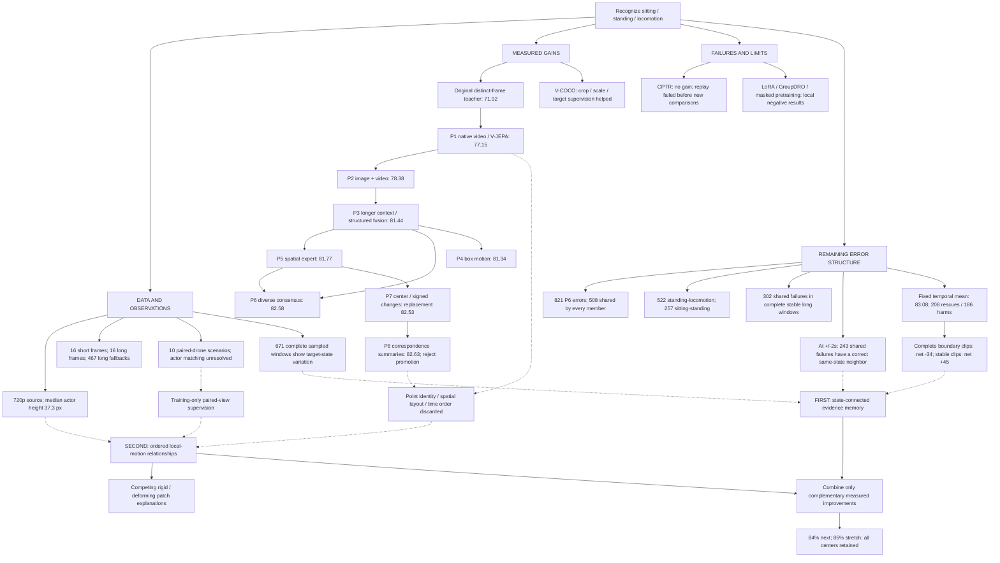

# HAC invention map and next experiments

Date: 2026-09-08. Baseline repository: `b28d562`, branch
`research/continuation-20260906`.

This plan follows independent architecture, data/error, and research reviews and a
joint challenge of the proposals. The objective is better classification and new
mechanisms. Publication preparation is deferred. No new model was trained during
this review. The new temporal-neighborhood measurements below are retrospective
diagnostics, including one fixed, untuned inference calculation.

## Decision

Implement **center-connected evidence memory first**. An ambiguous observation
should be able to borrow a more informative observation of the same actor, while
learning whether the actor changed state between those observations. Start with
the existing features and a fixed two-second neighbor radius.

Develop an **ordered local-motion expert** as the second experiment. It will retain
spatial detail and learn relationships between moving regions, addressing errors
that remain wrong throughout a track. The more ambitious extension will compare
rigid and deforming explanations of observed patch changes.

In parallel, investigate original 4K source videos and synchronized drone views.
Paired views could teach a model which changes come from the camera and which belong
to the actor. These investigations do not block the first memory experiment.

The next result targets are **84% macro-F1**, then **85%** on the same 4,977 center
labels. These are engineering objectives, not predicted outcomes. P6 at 82.5830%
remains the retained reference. Every extension must disclose changes in pixels,
temporal context, supervision, and trainable capacity.

## Aerial view of the research

Solid arrows describe lineage or an execution dependency. Dotted arrows connect
observations to hypotheses; they do not prove a causal mechanism.



## What the experiments say together

These are recorded results in their original comparison settings. Values from
different tasks or evaluation partitions are not points on one leaderboard.

| Experiment family | Result | Connection to the next design |
| --- | --- | --- |
| POLAR static study | Historical 93.99% four-class endpoint | Demonstrates source-domain capability; does not establish aerial performance. |
| V-COCO adaptation | Locked custom endpoint 70.71 -> 86.63; matched validation factorization +1.11 points | Person crop, scale, target labels, and representation mattered. Retain clear person views and useful posture structure. |
| Earlier sealed temporal comparison | Static 74.58 -> temporal 78.54; 50% routing 78.17 | Real observations contain useful information absent from a center frame. |
| Static distillation | 74.56 versus static 74.58 on that confirmation set | A teacher cannot make absent visual evidence appear. Paired-view training must retain an informative video student. |
| Original CPTR parts/tracks/residuals | 71.44 versus teacher 71.65 | Named branches alone did not create complementary evidence. |
| R1 CPTR replay | Numerical gate failed before intervention scores | Execution failure is not an experiment showing that the proposed repair fails. |
| T1 arithmetic within-clip pooling | 70.82; better probability loss | Better NLL does not imply better classification. This differs from the new across-center averaging diagnostic. |
| T2 distinct-frame sampling | 71.92 versus repeated 71.58 | Merely changing the sampler yielded little gain. |
| P1 real video | 77.15; repeated-center V-JEPA 63.65 | Strong observation/representation gain; repeated-center comparison removes extra appearances as well as motion. |
| P1 attentive head | 76.18 versus linear 77.15 | More general attention capacity alone is insufficient. |
| P2 video + DINO | 78.38 | Appearance and temporal representations complement one another. |
| P2 extra motion summaries / factorization | 78.37 / 78.22 | Extra summaries or a structured head are not universally beneficial. |
| P3 long video / final fusion | 80.43 / 81.44 | Duration is productive; final P3 beats P2 by 3.06 points. |
| P3 dual-scale video alone | 79.48 | Concatenating more features can hurt; preserve a strong simple control. |
| P4 compensated box trajectory | 81.34 | Box movement alone does not resolve the posture/gait problem. |
| P5 spatial / temporal / combined moments | 81.77 / 81.18 / 81.40 | Spatial layout is promising; separate spectral magnitudes did not exploit motion structure. |
| P6 three-member consensus | 82.5830; +10.6592 points over original | Complementarity helps. Its members still share 508 mistakes. |
| P7 center + signed feature changes | Expert 81.43; replacement 82.5350 | A linear head on derivatives did not exploit their information; system rescued one shared error. |
| P8 compensated point summaries | Replacement 82.6269; NLL/Brier worse | Only 29 rescues versus 32 harms; zero shared errors repaired by the system. |
| Earlier counterfactual losses | -2.449 / -0.810 points in their local screen | Do not manufacture standing labels by destroying motion. |
| Earlier masked pretraining / GroupDRO / LoRA | -0.624 / -0.234 / -3.018 points locally | An added objective or more trainable parameters requires an identifiable information advantage. |
| V0 SVM continuation | Iteration limit; no prediction metric | An unresolved computation, not a failure of SVMs as a family. |

P6 versus P3 was only +1.14 points with a development interval crossing zero.
The larger historical rise therefore cannot be attributed to ensembling alone.
P6 also followed an exposed ensemble screen. For current engineering decisions we
retain its exact predictions and demand a fair, reproducible comparison.

## New diagnostics that changed the team's priority

Source: the new `experiments/analyze_okutama_temporal_opportunity.py` and its output
under `.runs/research_20260908/temporal_opportunity/v2/`. It reads existing predictions,
the primary identities, and only allowed development annotations; it trains nothing.

| Observation | Measurement | Design implication |
| --- | ---: | --- |
| All three P6 members wrong | 508 of 821 errors | A fourth similar vote is unlikely to solve the dominant error population. |
| Standing / locomotion confusion | 522 errors overall; 311 shared | Preserve whole-person movement and local articulated movement separately. |
| Nearby correct observation, +/-1 second | Oracle coverage 163 shared errors; 153 with a same-state neighbor | Even short track memory contains unused evidence. |
| Nearby correct observation, +/-2 seconds | Oracle coverage 261; 243 with a same-state neighbor | Fix this radius for the first executable trial. |
| Nearby correct observation, +/-3 / +/-5 seconds | Oracle coverage 305 / 352; same-state 282 / 323 | Longer memory is an optional later branch, with larger latency and boundary risk. |
| Error concentration | Top 40 of 444 tracks contain 261 shared errors in 1,035 centers (20.8% of all centers) | Persistent hard tracks need new detail; neighboring centers are not independent new examples. |
| Native actor size | Median height 37.3 px; only 117/4,977 exceed 64 px | Resizing alone cannot create body detail; test source fidelity and temporal evidence accumulation. |
| Sampled long-window state variation | 772 centers, including 101 with missing/ambiguous slots; 671 complete unambiguous cases, versus 398 legacy transition flags | Use target sitting/standing/locomotion boundaries at actual input times. |
| Complete stable long windows | 3,730 centers; 481 P6 errors, 302 shared | Stability is an opportunity for evidence accumulation, not proof the actor is easy to classify. |

Track concentration breaks tied shared-error counts by total errors, then row count.
The oracle uses labels to ask whether a potentially useful neighbor exists. It does
not specify how to select one at inference and is not an achievable model score.
Equal state at two timestamps also does not prove that no intermediate transition
occurred. The sampled-window boundary audit may miss changes between sampled times.
Training boundary labels must use the allowed interval annotations and explicitly
mask gaps or ambiguity. Center labels matched the source for all 4,977 rows.

**One fixed diagnostic, no radius or weight search:** replace each center's P6
probabilities with the arithmetic mean of available same-track P6 probabilities
within +/-2 seconds, including the center. Retain every original row.

| Metric | P6 | Fixed temporal mean |
| --- | ---: | ---: |
| Macro-F1 | 82.5830% | 83.0792% |
| Accuracy | 83.5041% | 83.9462% |
| NLL | 0.416570 | 0.410732 |
| Brier | 0.240902 | 0.237756 |
| Rescues / harms against P6 | — | 208 / 186 |
| Repairs among 508 shared failures | — | 77 |
| Observed sampled state-variation rows, including 101 incomplete/ambiguous windows | 246 errors | 45 rescues / 86 harms; net -41 |
| Complete unambiguous state-variation windows (671 centers) | 207 errors; F1 65.76% | 39 rescues / 73 harms; net -34; F1 62.20% |
| Complete stable long windows | 481 errors | 126 rescues / 81 harms; net +45 |

Seven scenarios improve, but scenarios 2.2 and 2.7 lose approximately 2.97 and
3.01 macro-F1 points. This diagnostic is not promoted. It identifies a tradeoff:
nearby evidence can repair stable mistakes, but indiscriminate averaging propagates
state changes into the center's decision.

This is a larger-context condition: each neighboring prediction already consumes
its own clip. A +/-2-second neighbor radius gives an effective raw-frame envelope
of roughly +/-3 seconds with the long P3 inputs. It adds future access and latency.
The exact union of source frames must be reported; overlapping windows do not
constitute independent votes. A past-only version is a separate later experiment.

## Invention 1: center-connected evidence memory

### Mechanism

For each scored center, gather available same-recording, same-track observations
within two seconds using their true timestamps. Preserve masks and gaps. Use visual
features, existing component probabilities, observation quality and timestamp gaps.
Do not use scenario/track IDs as trainable features.

The model learns two different questions:

1. **State continuity:** did the target state change on the path to this observation?
2. **Usefulness:** does this observation contain evidence that helps classify this center?

For a center `c` and neighbor `j`, predict a nonnegative boundary hazard rate
`lambda_e` on each intervening temporal interval, survival `S`, and retrieval
attention `a`. Use physical interval duration, so adding more sampled centers does
not automatically erase continuity:

```text
lambda_e = softplus(boundary_head(interval_features, time_gap))
h_e = 1 - exp(-lambda_e * time_gap)
S(c,j) = exp(-sum over edges e from c to j of lambda_e * time_gap_e)
q(c,j) = usefulness_head(center_features, neighbor_features,
                        center_probs, neighbor_probs, time_gap, quality)
a(c,j) = softmax_j[q(c,j) + log(S(c,j) + epsilon) - abs(time_gap)/2s]
```

The center itself is a valid null-retrieval choice with survival one. Thus a weak
neighbor need not be used. Continuity is a soft prior rather than a hard cut: false
boundary predictions must not irrevocably remove the only useful observation.
Train `h_e` against whether a target-state change occurs in that observed interval;
mask incomplete/ambiguous supervision. Include a duplicate/drop-observation
diagnostic to measure sensitivity to sample density. The hazard parameterization
does not assume an actor's action changes at a constant rate.

Initially use a probability-mixture output with a learned center-dependent gate:

```text
p_memory = sum_j a(c,j) * p_j
p_new = (1 - g_c) * p_center + g_c * p_memory
```

Initialize the gate with sigmoid bias -4, leaving a nonzero gradient. Train the
classification and boundary branches directly. With no valid neighbor, return the
original center vector exactly. Avoid multiplying invalid NaN features by zero.

The head must be able to retrieve evidence inconsistent with the center's initial
prediction. Defining continuity as predicted-label equality would reinforce the
very center errors we want to fix.

### More creative, testable extension: complementary witnesses

Add single-neighbor and pair-support features so the model can distinguish one clear
observation from repeated weak votes. Two temporally separated observations that
support the same alternative may be useful, but do not require two witnesses as a
hard condition. Several overlapping clips can repeat the same wrong answer.

The audit gives a concrete reason: 243 shared failures have at least one correctly
predicted same-label neighbor within two seconds, but only 102 have two or more.
A hard two-witness requirement would discard 58% of that diagnostic opportunity.

Retain the same complete neighbor list in M1-M5. Use at most one contribution per
one-second bin only when constructing pair-support features, and expose clip
overlap/coverage. Compare a survival model with and without this extra support branch. Learn whether
pair support adds value; do not normalize products of probabilities and assume the
result represents calibrated independent evidence.

If the mixture succeeds but is limited by the probabilities it can combine, a
separate follow-up can learn a bounded logit residual from retrieved visual features:
`softmax(log(p_center) + alpha*tanh(residual))`. Fix `alpha` inside training folds
and compare against the mixture; this is not bundled into the first result.
Before that follow-up, measure the mixture's diagnostic ceiling by solving whether
any convex combination of available neighbor probabilities can make the true class
win. This is a small label-oracle linear program, not an inference rule. Distinguish
that ceiling from the simpler oracle that asks whether any one neighbor is correct.

### First experiment matrix

All temporal arms receive identical neighbors, timestamps and source observations.

| Arm | Trainable mechanism | Question |
| --- | --- | --- |
| M0 | None: exact retained P6 | Starting reference |
| M1 | None: fixed temporal arithmetic mean | How much does ordinary extra context recover? |
| M2 | Small temporal convolution | Does a standard sequence model suffice? |
| M3 | Ordinary query attention with learned usefulness and a boundary auxiliary loss that does not affect retrieval | Is selecting informative evidence sufficient with matched supervision? |
| M4, primary | M3 plus state-survival prior | Does separating state continuity from usefulness prevent cross-boundary harm? |
| M5 | M4 plus optional single/pair-support branch | Does complementary corroboration add more than selection? |

Use frozen encoders; project to width 128; keep each learned arm under one million
trainable parameters and report exact counts. For the first implementation use two
layers, four attention heads where applicable, and a matched input projection.
Give all arms the same training label population. M3 must receive the same boundary
loss as M4 without using survival in retrieval, so M4 does not win merely by
receiving additional supervision. M2 is a practical baseline;
M3 is the closest mechanism control.

Initial loss specification: class-balanced center cross-entropy, plus `0.2` times
boundary binary cross-entropy for M3-M5 and `0.001` times the mean squared fusion
gate for gated arms. Derive class/edge weights solely from the corresponding
training population; mask unknown boundary targets. Keep these coefficients fixed
in the first trial. Apply the same available center supervision to all learned
arms; do not oversample the globally identified 508 failures.

Proposed initial budget: five original outer scenario folds; three inner folds;
four optimizer settings (`lr` in {0.0003, 0.001}, weight decay in {0.0001, 0.01});
at most 30 epochs with inner-validation early stopping. Use seed 42 for inner
selection, then seeds 42/43/44 for each outer refit. Four trainable arms imply at
most `5 * 4 * (4*3 + 3) = 300` candidate fits, excluding base-prediction regeneration.
Choose epochs and calibration only within training groups. Batch size is chosen by
the resource pilot and then fixed across matched arms.

Regenerate all base probabilities used for learned retrieval/quality/fusion within
each relevant training partition. Existing global OOF probabilities are appropriate
for the diagnostic above, but their training ancestry crosses the partitions of a
new stack. Outer and inner selection must each respect the entire fitted pipeline.

The executable cache contract is:

- During inner validation, generate meta-training probabilities by cross-fitting
  bases wholly inside that inner-training population. Predict its validation groups
  using bases trained only on that same inner-training population.
- For an outer refit, generate fresh cross-fitted base predictions within all
  outer-training groups. Evaluate the outer holdout with bases fitted on all
  outer-training groups, and reproduce the frozen P6 outer reference.
- Key caches by exact training-ID hashes, feature/configuration hashes and model
  provenance. Include this regeneration cost in the resource estimate. Every base
  hyperparameter choice must also be confined to its permitted training population.

Train boundary hazards on the exact three-class interval labels in training scenarios;
walking-to-running is not a target boundary. Mask unknown intervals. At inference,
only images, model predictions, geometry, identity continuity and timing are allowed.

## Invention 2: ordered local-motion relationships

### What earlier architectures discarded

`src/hac/video_encoders.py::pool_spatiotemporal_tokens` reduces V-JEPA's
`8 x 24 x 24 x 768` output to `8 x 3 x 3 x 768`. Each saved spatial cell averages
64 original patches. The DINO cache keeps one CLS vector per frame. Later P3 means,
P5 absolute spectra and P7 feature derivatives cannot recover that discarded local
layout. Dynamic actor crops also remove much root movement in crop coordinates.

The next local expert should preserve region identity, time order, scene-coordinate
root displacement, and deviations around that root displacement. Body regions are
soft visual regions, not anatomical joints inferred from sparse LK points.

Start with a cheap existing-grid test of low-rank interactions:

```text
K(region_p, region_q, lag) = weighted mean over time of
    dot(U * change(time, region_p), V * change(time+lag, region_q))
```

Use actual time gaps and validity masks. Changes in learned tokens are representation
changes, not physical velocity. The question is whether two regions change together
or alternate across time. A linear head on separate signed derivatives cannot model
that interaction. Preserve first-order evidence alongside these interactions.

Independently authorize one fixed 3x3-versus-12x12 density pilot even if the coarse
interaction head is negative: it cannot reconstruct spatial detail already removed
by pooling. The coarse trial asks whether interactions alone are sufficient.
Retain a 12x12 grid and apply the same operator to finer regions, with optional
soft correspondence through time. Start with the same existing 16-frame long window
and exact fallback, so extra duration does not confound the token experiment.

Matched controls: pooled-token MLP, ordinary temporal adapter, ordered relational
head, and correspondence-based relational head. Shuffle region identity while
preserving marginal features as a diagnostic. Independently test root displacement
and local deformation removal. Use parameter-matched controls and no anatomical or
rigid-motion rules mapped directly to class labels.

### Higher-risk extension: competing explanations of motion

Ask two small models to explain the same sequence of framewise patch embeddings:

- A rigid explanation moves the actor as a whole after compensating for camera motion.
- A deforming explanation permits low-rank local changes around the actor's root motion.

Retain the spatial map of their residual difference, not just one residual magnitude.
The classifier sees which regions require local deformation, how that structure
changes with time, the root movement, and center posture. Regularize deformation and
include a matched unconstrained residual model: extra capacity alone can lower error.

If the warp estimator sees both endpoint frames, describe this as reconstruction.
A forecasting experiment must exclude the held target from the predictor and motion
estimator. Use framewise DINO patch targets; V-JEPA's clip tokens already incorporate
other times and cannot serve as evidence of a leak-free forecast without changing
their encoding. Synthetic camera warps may supply consistency supervision, but
destroying motion must not create invented standing labels.

This extension runs only after the ordered local expert demonstrates complementary
corrections, or as one separately budgeted exploratory prototype if that expert's
error maps indicate useful structure its classifier cannot exploit.

## Invention 3: one drone teaches another

The official Okutama documentation describes simultaneous two-drone recordings.
The current population has 10 paired scenarios among 21 recordings. There are 4,917
centers in paired scenarios, and 3,676 rows share a selected scenario timestamp with
at least one center from the other view (327 scenario/time keys). These are matching
opportunities, not verified same-actor pairs; frame synchronization is also unverified.

Use only training scenarios to build and verify cross-view actor/time matches.
Track IDs are local to a recording. Use temporal correspondence, appearance and
geometric consistency, with a bounded manual audit of proposed matches. Do not pair
people merely because their labels agree.

Train a paired-view teacher or actor-motion consistency loss, then deploy a
single-view video student. One view may reveal legs hidden in the other; common
actor dynamics can be learned while camera-specific changes remain separate.
Weight consistency by measured visibility and match quality. Keep view-specific
posture and camera channels instead of forcing every feature to be identical.

Controls: same-view augmentation, ordinary logit distillation, ordinary cross-view
contrastive learning, and the proposed motion-structure consistency. Include a
shuffled-match diagnostic. Keep both views of every scenario inside one fold;
the held scenario's other drone must never become training data.
Use synchronization, identity and visibility to define positive pairs. Do not make
nearby times automatic negatives when a state persists, or treat different actors
with the same class as interchangeable positives for actor-specific motion.

This differs from unsuccessful static distillation because the student still receives
video. It may learn a less view-dependent representation, but cannot be assumed to
recover an event completely invisible in its input.

## Data and compute priorities

1. Reuse existing 720p data, feature caches, timestamps and labels for memory first.
2. Audit genuine original 4K training videos in parallel. The official page lists a
   roughly 14 GB training archive, but a live download was not verified during this
   review. Compare actual 4K crops with an exactly downsampled control of the same
   frames, boxes and timestamps. Do not treat interpolation as new source detail.
3. Use paired existing drone views before collecting unrelated web video.
4. Consider TinyVIRAT for compatible low-resolution actor evidence if the native
   branches lack enough variation. Map actual actions carefully and inspect archive
   terms. Use UAV-Human or NEC-Drone only for a defined auxiliary task when access
   and label semantics fit. Sitting/standing transitions are not static posture labels.

Verified local resources: RTX PRO 3000 Blackwell laptop GPU with approximately 12 GiB
VRAM, 63.5 GiB RAM, and approximately 1.36 TiB free storage. One float16 V-JEPA scale
for 4,977 clips is approximately 0.51 GiB at 3x3, 8.20 GiB at 12x12, and 32.81 GiB
at 24x24, before overhead. A cache of sixteen 16x16 DINO grids is about 29.16 GiB.

Frozen extraction followed by small-head training is practical in principle. Measure
batch-one peak memory and throughput on a fixed 128-clip sample before scheduling
full dense extraction. The old 3x3-output extraction timing does not establish the
new cache I/O or training cost. No foundation-model pretraining is required.

## Implementation order and decisions

| Order | Concrete deliverable | Decision it resolves |
| --- | --- | --- |
| 0: completed in this review | Reproducible temporal-opportunity audit; new mind map and this plan | Where unused corrections exist and why averaging harms boundaries |
| 1 | Temporal identity/support manifest and full nested base-prediction lineage | Safe same-track retrieval with correct timestamps and missing-data behavior |
| 2 | M0-M5 runner and small resource/gradient smoke test | Standard sequence control versus usefulness, continuity and corroboration |
| 3 | Full grouped memory comparison with three outer refit seeds | Whether learned retrieval can retain rescues while preventing boundary harm |
| Parallel to 1-3 | 4K availability/detail audit and two-drone matching pilot | Better source detail and extra supervision from existing events |
| 4 | Ordered-grid relational trial and an independently permitted 3x3-versus-12x12 density pilot | Whether new local evidence repairs persistently wrong tracks |
| 5 | One competing-explanation prototype and/or verified paired-view training | Whether stronger supervision makes motion decomposition useful |
| 6 | Fixed combination of complementary winners, with nested fusion if learned | Whether the mechanisms combine toward 84-85% |

Before training, materialize a new protocol with these arms, settings, identities,
loss weights and exact raw-frame support. New scripts/modules should be separate
from retained phase implementations; anticipated names are
`src/hac/actor_evidence_memory.py`, `experiments/run_okutama_evidence_memory.py`,
and `experiments/okutama_evidence_memory_protocol.json`. They are planned, not
implemented by this document.

Engineering continuation rules for the first memory trial:

- M4 must improve macro-F1 and net corrections against M0 and the matched M1/M3
  context controls; compare M5 to M4 before retaining corroboration.
- Aim for at least 84% pooled macro-F1, while NLL/Brier do not worsen against P6.
- Repair at least 50 of the 508 shared errors as a mechanism screening target;
  report all new harms, not just rescues. This is a proposed threshold, not a power claim.
- Improve at least 7/11 scenarios and avoid a decline exceeding two points; report
  each class, complete stable windows, sampled boundaries and unknown windows.
- Reduce the fixed smoother's 73 harms on complete state-variation windows without sacrificing its stable
  corrections. This is a diagnostic objective, not a label-based inference rule.
- Report individual seed outcomes and their probability-mean system. Never select
  the best seed from outer results.

An arm below 84% may still be worth keeping if it supplies complementary corrections
at acceptable cost. If ordinary TCN or attention wins, deploy that gain and continue
the motion invention separately. If memory only repeats confident errors on hard
tracks, prioritize finer source detail and paired-view supervision. Do not keep
changing the radius or thresholds against the same exposed result.

Every report should include the full 4,977-row metric table, rescue/harm flow,
shared-error coverage, per-scenario changes, exact source-time coverage, validity,
and runtime. A forecasted score, label oracle, different endpoint, or data exclusion
must never appear as a measured improvement on the retained task.

## Evidence and useful research starting points

Local lineage:

- [Previous research map](HAC_RESEARCH_MAP_AND_NEXT_PHASE_20260907.md)
- [P7 negative result](HAC_P7_RESULTS_AND_P8_DECISION_20260907.md)
- [P8 result and original P9 direction](HAC_P8_CCAC_RESULTS_AND_P9_DECISION_20260907.md)
- [Continuation execution report](HAC_CONTINUATION_EXECUTION_REPORT_20260907.md)
- [V-COCO study](VCOCO_V2_EXTERNAL_TRANSFER.md)
- [Temporal diagnostic implementation](../experiments/analyze_okutama_temporal_opportunity.py)
- [Final diagnostic summary](../.runs/research_20260908/temporal_opportunity/v2/summary.json)
- [Track error aggregates](../.runs/research_20260908/temporal_opportunity/v2/track_aggregates.csv)

The final diagnostic summary has SHA-256
`d9bd3841cec9638083bb069e850680585d594af0dce4ec97b7e9b10c1c560947`.
Syntax compilation, full Ruff checks, formatting verification, and complete audit
execution passed. The original diagnostic output is preserved alongside `v2`.

Primary research sources inform implementation; none predicts an HAC improvement:

- [Okutama provider documentation](https://okutama-action.org/): simultaneous drone
  views, local track IDs, original source formats. Search-indexed page verified;
  direct page fetch timed out in this review.
- [Action Segment Refinement Framework](https://openaccess.thecvf.com/content/WACV2021/html/Ishikawa_Alleviating_Over-Segmentation_Errors_by_Detecting_Action_Boundaries_WACV_2021_paper.html):
  explicit state boundary prediction is a useful baseline for memory.
- [Long-term feature banks](https://openaccess.thecvf.com/content_CVPR_2019/html/Wu_Long-Term_Feature_Banks_for_Detailed_Video_Understanding_CVPR_2019_paper.html):
  context outside short clips is an established source of useful evidence.
- [TATs](https://arxiv.org/abs/2407.18249) and
  [Trokens](https://arxiv.org/abs/2508.03695): trajectory-aligned appearance and
  relationships provide implementation references for the local-motion branch.
- [Motionformer](https://arxiv.org/abs/2106.05392): motion-following attention.
- [Time-Contrastive Networks](https://openaccess.thecvf.com/content_cvpr_2017_workshops/w5/papers/Sermanet_Time-Contrastive_Networks_Self-Supervised_CVPR_2017_paper.pdf):
  simultaneous views can provide representation supervision.
- [ViewCon](https://openaccess.thecvf.com/content/WACV2023/html/Shah_Multi-View_Action_Recognition_Using_Contrastive_Learning_WACV_2023_paper.html):
  a cross-view learning control.
- [TinyVIRAT official project](https://www.crcv.ucf.edu/research/projects/tinyvirat-low-resolution-video-action-recognition/):
  a potential later source of low-resolution examples, subject to task and access fit.

The creative commitment is concrete: let the system learn where its useful evidence
is, whether that evidence still describes the center's state, and which physical
explanation of the actor's motion it supports. Test those mechanisms separately
before combining them.
