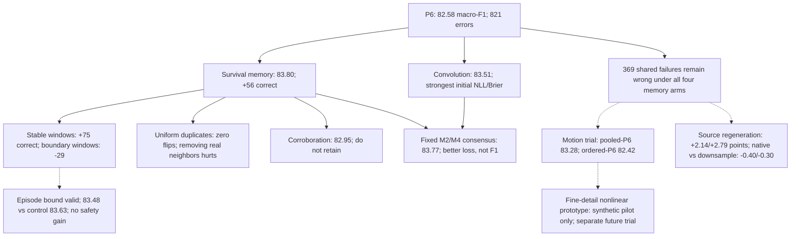

# HAC memory and ordered-motion execution

Date: 2026-09-08. This implements the experiments in
`HAC_INVENTION_PLAN_20260908.md`. Publication work is out of scope.

## Current status

The initial memory matrix is complete: 300 neural fits, all five folds, all four
arms and all three refit seeds. The 300-fit ordered-motion matrix, corrected
150-fit episode comparison and 390-fit controlled source comparison are also
complete. The final cross-family audit verifies 21 full-cohort model outputs and
210 pairwise error connections. No training worker remains active.
None of the initial memory arms passed every predeclared engineering check; P6
remains the reference, and M4 is the leading exploratory memory candidate.
Best measured F1 in this round is **83.8046%**, up 1.2216 points from P6. The 84-85%
objective remains unmet. Completed valid compute comprises 750 neural fits,
390 source-probe fits and 3,016 nested-base estimator fits; interrupted v1 and
diagnostic replay compute are additional, separately retained records.

| Completed full-cohort result | Macro-F1 | Accuracy | NLL | Brier | Rescues / harms versus P6 |
| --- | ---: | ---: | ---: | ---: | ---: |
| P6 reference | 82.5830% | 83.5041% | 0.416570 | 0.240902 | — |
| Fixed temporal mean | 83.0792% | 83.9462% | 0.410732 | 0.237756 | 208 / 186 |
| M2 temporal convolution | 83.5112% | 84.4083% | 0.406563 | 0.232793 | 214 / 169 |
| M3 query attention | 83.3230% | 84.1069% | 0.407958 | 0.235797 | 205 / 175 |
| M4 survival memory, three-seed ensemble | 83.8046% | 84.6293% | 0.406938 | 0.234389 | 248 / 192 |
| M5 corroborated memory | 82.9482% | 83.7251% | 0.411925 | 0.236376 | 219 / 208 |

M4 repairs 104 previously shared failures and improves accuracy in 7/11 scenarios.
It has not reached 84% macro-F1. Its three individual seed scores are 83.3002%,
83.2238%, and 83.0014%; the ensemble benefit is reported explicitly.

The main mechanism check is currently negative: M4 harms 83 previously correct P6
rows among the 671 complete sampled-boundary clips, versus 73 for the fixed mean.
These are new harms, not total errors in that stratum. Its gains are
stronger on stable clips (153 rescues / 78 harms). Raw boundary probabilities are
not automatically calibrated because the auxiliary loss upweights positive edges.
M4 exceeds matched M3 by 0.4816 macro-F1 points, but its trained effective
boundary-crossing weight is higher, not lower. This does not validate a simple
"survival safely blocks transitions" account. M5 adds complexity without improving
M4. Among the initial standalone learned arms, M2 has the best NLL/Brier and the
fewest boundary harms (71).
The paired scenario-bootstrap 95% interval for M4's macro-F1 gain over P6 is
[-0.0162, +2.9494] percentage points; these reused development scenarios are not
independent confirmation. None of the seven directional comparisons passes the
Holm-adjusted 0.05 test; M4 versus P6 has adjusted p=0.3828125.

One subsequently locked exploratory consensus used exactly half M2 and half M4,
without a weight search. It reaches 83.7681% macro-F1, 84.6695% accuracy, NLL
0.400171 and Brier 0.229828. It improves probabilistic losses but does not improve
M4's macro-F1 or meet the boundary-harm target (76). That outcome is retained,
not followed by trying more weights.

The preserved episode-v1 matched log-survival control completed all 75
fits and all 4,977 rows: 83.3074% macro-F1, NLL 0.406026 and Brier 0.234862,
with 219 rescues / 184 harms and 84 shared-error repairs. Boundary harms remain
83. Its independently supervised, proper-loss hazard is better calibrated than
old M4 on deduplicated physical edges (NLL 0.31310 versus 0.42779; Brier 0.08683
versus 0.12035; ECE 0.04533 versus 0.10777). This does not improve M4's classifier.
The v1 expected-episode arm stopped at the coefficient-bound gate after 97 total
completed fits (75 control and 22 candidate). The failed fit was fold1/config2/
inner1; it is not an overall candidate result. Original sources, receipts and the
failed request are retained unchanged. Label-blind stress testing reproduces
float32 cumulative-prefix cancellation that makes path survival and segment masses
inconsistent. One forensic replay reproduced the actual epoch10 failure exactly:
attention exceeded reported survival by 1.190824e-6 against the unchanged 1e-6 gate.
A prefix of 32.18798 hid local masses around 6e-6. Direct path sums and float64
probability arithmetic reduce the actual-case excess to 1.11e-16 and segment-mass
error to 2.22e-16. Hazard outputs and usefulness remain bit-exact; the maximum class
probability change on that frozen batch is 2.24e-8. No tolerance has been relaxed.
The corrected v2 requires a fresh, matched execution with both arms rerun. Early
hazard gradient norms did match the control exactly, so this numerical failure
does not undo the gradient-separation check.

The v2 trial launched at 04:07 local time after both independent reviews, 66
focused tests, the synthetic GPU pilot and actual-failure validation passed,
and completed all 150 fits and its full-cohort summary at 04:22.
Its lock is `ed8d0fcaccd99e210b87f758bfeffcfb9add3a5131ccc9982441033ca82a3eb1`.
It used 150 fresh neural fits and zero new base fits. The 97 v1 completed
fits, its failed attempt and the single forensic replay remain separate records.

All classifier comparisons retain the original 4,977 centers, three target classes,
11 scenarios and five outer scenario folds. None uses the protected validation/test
population.
Memory uses offline neighboring observations at -2, -1, 0, +1, +2 seconds; the union
of actual source frames spans up to six seconds. It is not a causal streaming model.

## Implemented comparisons

| Matrix | Arms | Selection and refits |
| --- | --- | --- |
| Evidence memory | Fixed P6; fixed temporal mean; convolution; query attention; survival memory; corroborated memory | Four learned arms, 3 grouped inner folds, 4 optimizer configurations, up to 30 epochs; 3 outer seeds: at most 300 neural fits |
| Ordered local motion | Pooled MLP; temporal adapter; ordered cross-lag interactions; correspondence interactions | Same nested selection/seed budget, at most 300 neural fits; standalone expert and prospectively fixed equal-probability P6 blend |
| Center-episode v2 | Log-survival control; expected center-containing episode | Two equally sized 849,059-parameter arms, same nested optimizer/seed budget: 150 fresh fits; independently supervised hazard and unchanged coefficient-bound gate |
| Controlled source inputs | Supplied 720p; native4K; exact source downsample, each with global or spatial-contrast pooling | Six independently fixed heads, five outer and three inner folds, four logistic regularization values: 390 fits |

Memory heads have 516,482 / 773,571 / 773,571 / 782,669 trainable parameters.
The attention and survival heads have identical learned components and boundary
supervision; only the survival head uses continuity probabilities during retrieval.
The optional corroboration branch never demands two agreeing neighbors.

Ordered-motion heads use the same existing video tokens, exact short fallback,
geometry and time information. They do not infer anatomical joints or claim that
token differences are physical velocities. The post-fit P6 blend is fixed at 0.5;
historical OOF predictions do not enter their fitting or selection.

These are distinct interventions. Memory adds neighboring clip observations and
boundary supervision to nested P6 probabilities. Ordered motion changes the head
while retaining its matched controls' video, geometry and time inputs. The source
experiment changes the input-generation chain under frozen encoders and matched
probe heads. None fine-tunes a foundation model. Source-only scores should be
compared first to their own supplied-frame controls, not treated as P6 replacements
without retraining and evaluating the complete pipeline.

## Completed validation and data work

- All 50 focused memory/model/data/base/training tests pass.
- The latest full repository suite passes: 853 tests in 85.22 seconds. This includes
  all 66 episode v1/v2 model/trainer/runner checks, five observation-density tests
  and five cross-family connection tests. All 44 new Python files pass Ruff and
  formatting checks without changing any locked source.
- Every relevant fitting population regenerates its own base probabilities:
  58 distinct populations and 3,016 logistic estimator fits completed.
- All 4,977 regenerated P6 probabilities are **bit-identical** to the historical
  reference. No tolerance was relaxed.
- Twenty meta-training populations passed coverage checks; 99,540 row-level
  ancestry checks found no training/prediction scenario overlap.
- Memory supervision contains 13,991 fully observed annotation intervals, including
  1,279 state-change events. Unknown intervals are masked. All interval labels come
  from the permitted training recordings.
- The full 12x12 frozen-token cache is complete for all 4,977 centers. Its parallel
  3x3 extraction reproduces the old cache exactly, including all 467 short fallbacks.
- The original 4K training-video archive was acquired (14,985,760,603 bytes).
  Recording-specific MP4 timeline offsets were verified before extraction. All
  14,463 required source-frame comparisons passed (maximum image MAE 1.826/255).
  Paired native4K/exact-downsample crops are complete for the 21 permitted training
  recordings: 75,178 paired crops in 958.62 seconds. Exact 720p whole-clip fallbacks
  preserve the 29 centers without verified default-decoder source support.
- All 128 native/downsample prepared tensors for the independent 64-clip pilot
  replay exactly. Full paired feature encoding is complete for all 4,977 centers
  in 1,685.80 seconds (44.07 minutes including crop preparation, excluding final
  hashing), with 0.526 GiB peak CUDA allocation in that process. Independent final
  hash, identity, completion and fallback checks passed. The fixed six-arm source
  screen is complete; its source/rendering gain and negative extra-resolution
  control are reported below.
- Paired-drone actor/time matches remain unverified. No paired-view supervision is
  being fabricated or used.

The mixed eligible index contains 1,383 descriptive-validation metadata rows from
six separate recordings. Those rows were parsed before filtering, not fitted or
materialized. They are not the skipped every-180th-frame timestamps. No protected
calibration/confirmation/test inputs were used. The precise accounting clarification
is preserved separately from the immutable execution lock in
`diagnostics/access_accounting_clarification_v1.json`.

An evaluation-only convex-mixture oracle can repair 500 of the 821 P6 errors using
the fixed neighborhood. Requiring fully observed, unchanged target-state paths
reduces this to 458. These are label-dependent opportunity counts, **not model
results**, and were not used to change the locked training matrix.

The replay checks exposed and fixed two numerical implementation differences:
factorized decoding must preserve the original float32 subtraction followed by
float64 arithmetic, and held-row binary predictions must use the original batch
shape. Fitted coefficients and scalers were already identical. Regression tests
now cover both cases.

## Trained-model observation-density audit

The original plan's density check is now complete on all 60 saved outer refits,
without an optimizer or changed checkpoint. Every unperturbed probability replay
is bit-identical. Two fixed stresses were declared before their inference:
mask the inner neighbors at -1/+1 seconds, or duplicate every observation and its
physical timestamp. Neither adds pixels or extends temporal support.

| Arm | Original F1 | Drop inner neighbors | Duplicate all observations | Duplicate prediction flips |
| --- | ---: | ---: | ---: | ---: |
| M2 convolution | 83.5112% | 82.9914% | 83.5264% | 101 |
| M3 attention | 83.3230% | 82.7291% | 83.3230% | 0 |
| M4 survival | 83.8046% | 82.8383% | 83.8046% | 0 |
| M5 corroboration | 82.9482% | 82.6178% | 82.9758% | 1 |

Uniform duplication preserves M3/M4 classification, while discarding actual
observations hurts both. M4 therefore passes this particular no-new-information
stress despite failing the separate boundary-harm objective. The convolution
changes its effective neighborhood topology under duplication; M5 also counts a
repeated center among its support witnesses. Ten slots are outside the five-slot
training distribution. These are robustness diagnostics, not candidate scores or
an invitation to select a sampling transformation from outer results.

Receipts: `evidence_memory/diagnostics/observation_density_v1/`.

## Corrected center-episode comparison: complete

Both v2 arms cover all 4,977 rows, with 75 fresh fits per arm and an identical
849,059-parameter architecture apart from the probability-allocation operator.
The v1 control above is not used as the matched comparator for this result.

| V2 arm | Macro-F1 | Accuracy | NLL | Brier | P6 rescues / harms | Shared-error repairs |
| --- | ---: | ---: | ---: | ---: | ---: | ---: |
| Matched log-survival control | 83.6304% | 84.3480% | 0.404336 | 0.234042 | 226 / 184 | 92 |
| Expected center-containing episode | 83.4801% | 84.1270% | 0.408971 | 0.236474 | 247 / 216 | 103 |

The proposed operator trails its control by 0.1503 macro-F1 points, with 81 rescues
and 92 harms relative to that control. The paired scenario-bootstrap 95% interval
is [-1.2645, +0.7260] points; directional exact-swap p=0.6201. The extra shared-error
repairs do not offset new harms, and neither arm improves M4 or reaches 84% F1.

On the original 671 boundary rows, control and candidate have 49/84 and 52/91
rescues/harms against P6, respectively. Both miss the fixed smoother's 73-harm
objective. On 3,730 stable rows their net corrections are +68 and +62. The
numerically valid predicted-survival coefficient bound therefore does not establish
the intended classification or boundary-safety benefit. It bounds direct borrowing,
not all contextual influence or true-state continuity.

On 4,431 deduplicated physical edges, the candidate has better boundary calibration
than the control (Brier 0.086261 versus 0.086704; NLL 0.297989 versus 0.308361;
ECE 0.035331 versus 0.039708). Nevertheless its mean gate increases from 0.7462 to
0.9094, effective center weight falls from 0.4450 to 0.3126, and the observed
effective weight crossing true boundaries increases from 0.3209 to 0.3637.
These diagnostics reject the assumption that a calibrated auxiliary hazard and
a valid direct-coefficient bound automatically yield safer final classification.
They are descriptive measurements, not isolated causal interventions on the gate.

Individual seed F1 scores (42/43/44) are 83.2788/82.4558/83.3857% for the control
and 82.6903/83.1024/83.2389% for the candidate; no best seed was selected. A second
audit verified all 150 fit receipts, exact three-seed means, inner selection,
58-population base ancestry and saved prediction identities. The 46 singleton
fallbacks remain bit-exact. Maximum saved candidate bound excess is 1.11e-16
against the unchanged 1e-6 gate. Summed fit time is 902.27 seconds; the worker
exited cleanly.

Receipt: `center_episode_v2/results/v0001/summary.json`, SHA-256
`9ae87a0a5e649084e510b66c0f9d5a86ca16ba579c79536adaf84a965ae6cc31`.
The candidate is not promoted and no further episode weight/configuration search
is appended to this comparison.

## Ordered-motion comparison: complete

All 300 fits and 20 arm/fold workloads completed without errors. Every arm receives
the same frozen 3x3-grid tokens, time and geometry information, exact 467 short
fallbacks and nested selection budget. Learned capacity is approximately matched
(712,451 to 757,123 parameters), not exactly identical.

| Motion head | Standalone F1 | Standalone NLL | Fixed half-P6 blend F1 | Blend NLL | Blend P6 rescues / harms | Blend shared repairs |
| --- | ---: | ---: | ---: | ---: | ---: | ---: |
| Pooled MLP control | 82.1267% | 0.705096 | 83.2799% | 0.415183 | 166 / 147 | 43 |
| Temporal-adapter control | 81.4720% | 0.615417 | 82.8006% | 0.413316 | 138 / 133 | 26 |
| Ordered relational, primary | 81.4462% | 0.654977 | 82.4172% | 0.418091 | 141 / 149 | 33 |
| Correspondence relational | 80.8089% | 0.585246 | 82.0771% | 0.423085 | 114 / 135 | 14 |

The primary architecture trails pooled MLP by 0.6805 F1 points and the temporal
control by 0.0258 points. Correspondence does not improve it. Both proposed fixed
blends trail P6, and all five declared directional comparisons have Holm-adjusted
p=1.0. This is a negative result for the tested relational mechanisms, not proof
that motion understanding is useless. The simple pooled blend is a useful
complementarity result but remains below M4 and the 84% objective.

The fixed time-permutation stress changes primary ordered F1 from 81.4462% to
81.1609%; correspondence changes from 80.8089% to 80.9115%. Region permutation
reduces them to 78.4641% and 78.9915%, respectively. These are inference
distribution shifts, not retrained causal ablations, and do not establish physical
motion understanding. The original spatial layout is consequential; the present
evidence does not validate the proposed ordered interactions over simple controls.

All three seeds and their probability mean are retained. Primary ordered seed F1
scores are 80.4139/81.1239/79.9227%; correspondence scores are
79.0970/80.8748/79.6556%. The table uses the declared seed means, not a selected seed.

An independent review additionally reconstructed all 80 inner candidate metrics,
20 selected configurations and epoch medians, 60 seed outputs and 19 distinct
train-only feature scalers. All 300 checkpoint payloads, fit identities and
artifact inventories passed; seed means and blends reproduce bit-exactly. The
pooled blend improves accuracy in 8/11 scenarios but loses 3.08 points in its
worst scenario, so it does not satisfy a robust system-promotion claim.

The standalone ordered expert does repair 24 original shared failures that both
ordinary controls miss. This supports only a weak, separately budgeted exploratory
fine-detail test: it does not override the negative system result or justify
scaling up the current coarse heads. V-JEPA tokens already contain temporal
context, including in the pooled control.

Receipt: `ordered_motion_v2/results/summary.json`, SHA-256
`d4dac6dffa0388a53c1753ebc6850c1c0fb375fc14f699f56c4373acef6b0e4e`.

## Controlled source experiment: complete

All 390 logistic estimator fits completed in 950.48 seconds. The historical
existing720 global-mean probabilities replay **bit-identically** on all 4,977 rows;
no replay tolerance was relaxed. Both new sources retain the exact same selected
source times and the 29 required source fallbacks, and no new DINO features,
duration, class labels or backbone training were added.

| Source | Global mean F1 | Global mean NLL | Global + spatial contrast F1 | Spatial NLL |
| --- | ---: | ---: | ---: | ---: |
| Supplied 720p frames | 80.4254% | 0.466482 | 79.2378% | 0.482153 |
| Native 4K source | 82.1686% | 0.451490 | 81.7266% | 0.445918 |
| Exact downsample of native source | 82.5642% | 0.440481 | 82.0302% | 0.446791 |

The important control is negative for extra resolution: native4K trails its
exact-downsample control by 0.3956 / 0.3036 macro-F1 points, with 144 rescues /
165 harms for global pooling and 137 / 151 for spatial contrast. Source-derived
downsampled inputs beat the supplied frames by 2.1389 / 2.7924 points. This
identifies a useful source/rendering-chain difference, **not** evidence that more
pixels, any one codec, or a new architecture caused the gain. The two heads are
fixed independent comparisons, not an outer-selected source/head ensemble.

The follow-on scenario-block uncertainty audit supports prioritizing regeneration:
exact downsample versus supplied frames has F1 intervals [+1.0703, +4.0934] points
for global pooling and [+1.1450, +5.4226] for spatial contrast, with Holm-adjusted
p=0.008789 and 0.039063 over the six fixed source contrasts. Native versus matched
downsample intervals cross zero: [-1.3830, +0.6935] and [-1.2420, +0.7925] points.
These additional analyses reuse development scenarios; they are not independent
confirmation or proof that native resolution is universally inferior.

The source-derived global head nearly matches P6's macro-F1 by itself, but neither
new source head exceeds the current M4 result and their probabilistic losses are
worse than P6's. Any replacement in the larger memory/consensus pipeline needs
its own correctly nested trial; no new source blend was tuned here.

Source receipt: `native4k_source_effect/results/summary.json`, SHA-256
`796412e96290db8576298e1811a7b37d7fa2d813b32c963220a3926efe492fb1`.
Detailed checks and all six contrasts are in `HAC_SOURCE_VIEW_AUDIT_20260908.md`.

## Cross-family error connections

The final read-only connector checked all 4,977 identities and labels, 11 scenarios,
five folds, source/protocol bindings and each family's completion evidence. It
performs zero fits and creates zero fusion rules. It reports every pair among
21 fixed outputs, plus class, scenario, actor-height, fallback and temporal strata.

| Comparator to M4 | Error correlation | M4-only correct | Comparator-only correct | Additional shared-error repairs beyond M4 |
| --- | ---: | ---: | ---: | ---: |
| Pooled MLP | 0.526 | 370 | 276 | 57 |
| Ordered relational | 0.559 | 363 | 246 | 47 |
| Correspondence relational | 0.557 | 376 | 242 | 36 |
| Expected episode | 0.856 | 107 | 82 | 19 |
| Native4K global probe | 0.566 | 344 | 249 | 42 |
| Regenerated-downsample global probe | 0.567 | 329 | 255 | 43 |

The episode variant largely repeats M4's mistakes. Visual heads make more distinct
corrections, but the new relational mechanisms do not improve on the simple pooled
control's complementarity. Low error correlation alone is not sufficient: every
comparator here also loses more M4-correct rows than it uniquely repairs.
The last column uses labels to identify opportunities among the original 508
shared errors; it is not an implementable selector or a combined-model score.

The most useful task-level separation is between stable context and center-local
evidence. On the same 671 boundary / 3,730 stable rows, net corrections versus P6
are -29 / +75 for M4 but +15 / +3 for the pooled-P6 blend. The ordered blend gives
+6 / -11 and correspondence 0 / -20. This motivates a future joint local-evidence
and memory comparison; it does not authorize an inference router that reads true
boundary labels or an outer-tuned combination.

Artifacts: `phase_connections_v1/summary.json`, `metrics_by_stratum.csv` and
`pairwise_error_connections.csv`. Summary SHA-256:
`e2119009ae7a3110b29a87f6c35b5120a15fb97bf2d1a70bee9e2ab62e37cbb5`.

## Artifacts and reproduction

Memory run: `.runs/research_20260908/evidence_memory/`

- `execution_lock.json`: frozen protocol and input/source hashes.
- `training.stdout.log`, `training.stderr.log`: preserved execution logs.
- `models/<arm>/fold-<fold>/`: inner selection, three refits, checkpoints, receipts.
- `results/summary.json`: full-cohort results only for completed arms; incomplete
  arms are explicitly listed as missing.
- `base_preparation.json`, `base_replay.json`: nested ancestry and exact replay.

Ordered-motion run: `.runs/research_20260908/ordered_motion_v2/`. The prepared v1
artifacts are preserved; v2 fixes batch size at 128 based only on a synthetic
resource pilot, before any classifier fitting.

Frozen dense tokens: `.runs/research_20260908/dense_tokens_full/verification.json`.

Paired source features: `.runs/research_20260908/native4k_paired_full/features/`.
The encoder's exact launch-source snapshot is retained and separately bound in
`execution_source_binding.json`; a later change to the classifier function is not
misreported as encoder source. The CPU classifier has its own byte-verified
execution lock under `.runs/research_20260908/native4k_source_effect/`.

Episode run: `.runs/research_20260908/center_episode_v1/`. Its separate execution
lock is `3291548b309e48563d9720e891a2357e8c717ebb05084c881505af08d78a1e7b`.
This is the preserved, numerically interrupted version. Completed corrected training is in
`.runs/research_20260908/center_episode_v2/`, using zero new base fits. Independent
review verifies all 12 inner fits and three outer refits per arm/fold before
accepting a completion manifest. Final cross-family comparisons bind v2 explicitly.

Do not change a frozen architecture/protocol inside an active run. Resumption
checks source and data hashes and reuses only matching completed fits. Incomplete
fits may be rerun; original completed artifacts are not overwritten with a different
request.

### Reproduction and inspection

Run commands from the repository root with the retained `.venv`. Evaluation writes
receipts but performs no training:

```powershell
.venv\Scripts\python.exe -m pytest -o addopts='' -q
.venv\Scripts\python.exe experiments/analyze_okutama_memory_results.py
.venv\Scripts\python.exe experiments/run_okutama_ordered_motion.py --stage aggregate
.venv\Scripts\python.exe experiments/run_okutama_center_episode_v2.py --stage summarize
```

The ordered aggregator intentionally refuses incomplete workloads. Episode summary
versions explicitly indicate whether all 150 fits and both arms are complete.
Memory diagnostics and episode summaries create new numbered versions; retain
the published version when comparing hashes. Training, extraction, frozen source
snapshots and dependency hashes remain bound by each run's own execution lock.
The interrupted episode v1 must not be resumed or mixed into the v2 comparison.

## Decisions after results

The completed findings narrow the next phase to controlled input regeneration and
better use of center-local evidence. They do not justify more corroboration
features or an expanded coarse correspondence head:



Solid arrows summarize measured lineage/diagnostics; dotted arrows motivate tests,
not established causal explanations. On the geometry-cache height bands, M4's
net corrections are +41 for actors at most 32 pixels tall, +13 for 32-64 pixels,
and +2 above 64 pixels. These observational, scenario-confounded counts motivate
the controlled source comparison; they do not prove that resolution caused errors.

1. **First next implementation: a nested source-input swap.** Replace only the
   corresponding long-video V-JEPA streams with verified source-derived-downsample
   features; keep other image/short-video streams, centers, class definitions,
   folds and memory radius fixed. Regenerate every affected P6 base fit and inner
   prediction before retraining memory. Compare old/new input pipelines, not a
   source probe pasted onto old OOF meta-training features. The controlled source
   gain makes this the strongest immediate lead; no combined score is claimed yet.
2. **Next architecture hypothesis: separate local evidence from persistent memory.**
   M4 helps stable clips, whereas the simple local pooled expert helps boundaries.
   A future jointly trained local-expert/memory model should compare ordinary and
   boundary-conditioned routing with matched capacity and supervision. Its local
   branch must be able to create a new center prediction, not only redistribute
   old neighboring probabilities. Learn any routing from legitimate training
   populations; true boundary labels remain supervision/diagnostics, never an
   inference selector. The present results motivate this mechanism but do not test it.
3. **Bounded creative motion branch: fine static versus temporal detail.** The
   12x12 nonlinear prototype and synthetic resource pilot are implemented; they
   are not classifier accuracy results. Before a stronger rigid/deforming model,
   compare fine static posture detail and fine temporal-change detail against
   the matched repeated-3x3 control. Keep the current coarse heads rejected.
   Paired-view training remains gated off because same-actor/time matches were
   not verified. Do not replace missing correspondence evidence with guessed pairs.

The four tested memory heads leave 369 of the original 508 shared failures
unresolved. This does not prove that new pixels are necessary; a better use of
existing features could also help. These next experiments are explicitly not
included in the completed scores above. All prior executions remain immutable.

The episode proposal builds on known ideas in
[monotonic attention](https://proceedings.mlr.press/v70/raffel17a.html),
[chunkwise attention](https://arxiv.org/abs/1712.05382), and
[structured attention](https://arxiv.org/abs/1702.00887). The experiment tests a
specific center-containing, two-sided mechanism and direct probability-mixture
coefficient bound; it does not claim those general ideas are new.

Completed outputs include macro-F1, per-class F1, accuracy, NLL, Brier,
rescued/harmed errors, shared failure repairs, scenario changes, boundary/stable
strata and seed variability. The original sampled-window boundary mask is used
for the historical 73-harm comparison; new full-interval masks are reported
separately in the episode and memory diagnostics.

Keep the 84% objective distinct from an achieved score. Continue a sub-target
candidate only if its measured corrections justify the next branch. Advance a
rigid/deforming residual prototype only under the plan's complementary-error gate.
Combine experts through a newly declared, correctly nested trial, not a blend
weight selected on the reported outer labels.
