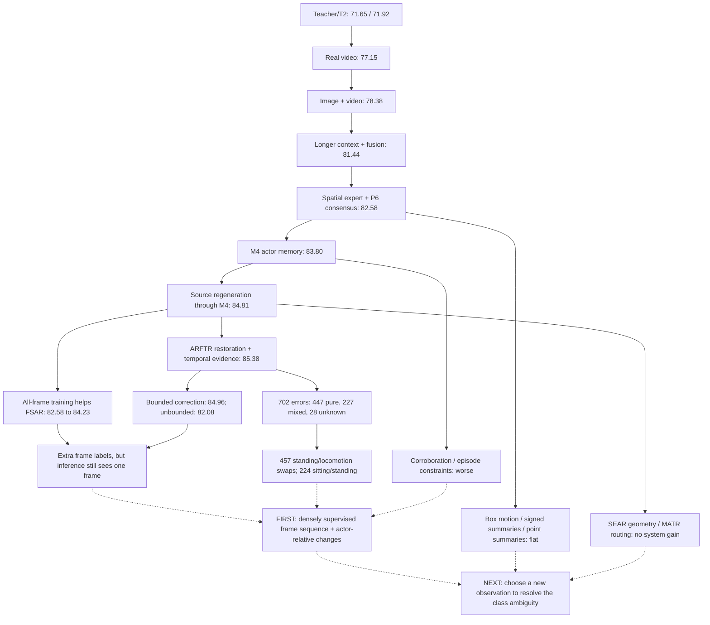

# HAC: experiment map and next architecture decision

2026-09-12. Three parallel reviewers examined experiment lineage, error opportunities, and architecture design. This phase performed analysis only: zero model fits. This plan supersedes the proposed follow-up in `HAC_BOUNDED_FACTOR_CORRECTION_RESULTS_20260912.md`; historical results remain unchanged.

## Decision

The next experiment should learn an action timeline from the actual individual frame observations already cached. The proposed addition is an actor-relative change representation, trained to distinguish action changes within the same person. Its strongest comparator is an ordinary temporal sequence model with identical inputs and supervision.

The more ambitious follow-on is a model that selects a new observation according to the action ambiguity: posture detail, a short motion sequence, or movement relative to the background. It must demonstrate that its selected observation improves classification beyond fixed observation allocation. Another gate over existing classifier scores is a low priority.

Current best internal result: **85.383648% macro-F1**, versus **71.923768%** for the early T2 control: **+13.459880 percentage points**. Errors fell from **1,412 to 702**. The original retained teacher was 71.648321%, slightly below T2. These gains combine observation, encoder, source, supervision, and architecture changes; they are not the isolated effect of one invention. ARFTR's computation is audited, but its last incremental gain did not pass its strict scenario significance screen.

## Experiment map



Solid arrows describe progression or diagnostic relationships; dotted arrows motivate hypotheses. They do not imply independent additive effects.

| Tested family | Result, macro-F1 % | What survives the evidence |
|---|---:|---|
| Real / repeated-center video | 77.15 / 63.65 | Distinct observations matter; this does not isolate motion from extra appearances. |
| Image+video / longer context+fusion | 78.38 / 81.44 | Complementary representations and duration produced large gains. |
| P5 spatial / temporal / combined moments | 81.77 / 81.18 / 81.40 | Small spatial gain; more summaries did not reliably help. |
| P4 / P7 / P8 systems | 81.34 / 82.535 / 82.627 | These box, signed-feature, and coarse correspondence recipes stalled. |
| Neighbor mean / convolution / attention / M4 | 83.079 / 83.511 / 83.323 / 83.805 | Nearby actor evidence is valuable; simple sequence controls are strong. |
| M5 / episode v2 | 82.948 / 83.480 | More borrowing constraints did not improve classification. Episode control:83.630. |
| Pooled / ordered / correspondence blends | 83.280 / 82.417 / 82.077 | Simple pooled features beat these coarse relation mechanisms. |
| Source swap, P6 | 82.583 to 83.710 | Strong matched observation-processing gain; native4K was not superior to regeneration/downsampling. |
| Source swap, M4 | 83.805 to 84.811 | Useful improvement propagated through the nested pipeline. |
| SEAR unrestricted / shared geometry | 81.389 / 80.584 | Shared geometry failed; unrestricted A3 remains a useful complementary component. |
| MATR boundary / unrestricted routing | 84.480 / 84.004 | Oracle complementarity did not translate into successful routing. |
| Fixed A3 correction / class-diagonal correction | 84.950 / 84.977 | Modest gains; class-diagonal branch failed its continuation criterion. |
| ARFTR without / with temporal step | 85.102 / 85.384 | Temporal update helps aggregate accuracy but gives back some transition gains. |
| FSAR center / all-frame supervision | 82.581 / 84.226 | Broader supervision helps; both still use center-only features at inference. |
| Bounded center / all-frame / shared-output | 84.599 / 84.964 / 85.102 | Bounds reduce harm; no new system gain. |
| Unbounded all-frame correction | 82.077 | More freedom produces 158 rescues but299 harms. |

CPTR parts, early counterfactual objectives, GroupDRO, and top-block LoRA also failed their tested comparisons. This is evidence against those recipes, not every possible use of parts or adaptation. POLAR's approximately94% and historical label-oracle scores belong to other endpoints or nondeployable calculations.

## Fresh diagnostics and corrections to earlier interpretation

The reproducible new diagnostic is `.runs/research_20260912/next_phase_diagnostic_v1/summary.json`, generated by `experiments/analyze_okutama_next_phase_20260912.py`. It checks exact sample, label, scenario, fold, and neighbor identities and records input hashes.

| Diagnostic | Result | Consequence |
|---|---|---|
| Current errors by support | Pure447; mixed227; annotation-unknown28 | A transition-only solution excludes most remaining errors. |
| Current confusion pairs | Standing/locomotion457; sitting/standing224; sitting/locomotion21 | Motion evidence and posture evidence both need work. |
| Current confidence at least0.9 | 77 errors among2,247 predictions | High confidence cannot be a universal do-not-correct rule. |
| Existing P6/A3/FSAR/bounded sources, oracle selection | 266 errors repairable;90.723% oracle F1 | Existing complementarity exists, but selecting correctly requires unavailable labels. |
| Exact same-track neighbors within2seconds, oracle selection | 268 errors repairable;90.501% oracle F1 | Local observation opportunity exists. |
| Actual uniform averaging within2seconds | 84.445%;59 rescues/113 harms | Opportunity is not realized by broad smoothing. |
| Four sources plus2second neighbors, oracle | 398 repairs;304 shared errors remain | Even this extensive bank lacks a correct candidate for304 errors. New evidence remains necessary. |
| Common per-row factor correction within +/-0.5 | 216 errors reachable;486 unreachable | A small correction box cannot fix many confident mistakes. This diagnostic constrains the same delta across seeds; it is not an exact ceiling for independent per-seed models. |
| Bounded primary saturation | About68% posture deltas have magnitude at least0.49 | Corrections frequently hit the bound. Increasing it alone is unsupported by the unbounded failure. |

All oracle scores are retrospective upper bounds, not trained results or forecasts. Error correlations reinforce the same point: ARFTR/P6 is about0.757, ARFTR/A3 about0.633. A3 is more complementary, yet direct substitution creates too many harms.

Three statements in the previous follow-up need correction:

1. **True support purity and annotation-unknown status cannot drive inference.** They are derived from action annotations. Only observed input availability or learned predictions from permitted inputs can drive decisions. Unknown annotations are not the same as missing images.
2. **The separate/shared test concerned auxiliary-classifier versus correction outputs.** Both models use posture/motion coordinates. It did not test separate spatial-posture and temporal-motion encoders.
3. **Mixed-support net improvement does not prove only mixed cases contain useful evidence.** The bounded primary repaired46 pure-support errors and harmed59. Both useful and harmful interventions occurred there.

## Priority 1: actor-relative frame-sequence model

Working name: **Actor-Relative State Sequence (ARSS)**. This is a proposal, not a proven novel method.

Use the existing short/long DINO frame descriptors, actual frame timestamps, crop/source identity, and masks. Supervision covers114,951 physical actor frames across444 tracks; these are observations from the existing scenarios, not114,951 independent examples. Keep the original center target and full cohort.

The proposed representation keeps absolute appearance and adds changes relative to the same actor's local reference:

```text
z_t = projection(frame_feature_t)
b   = masked robust pool of z_t over the permitted local window
d_t = z_t - b
h_t = temporal_encoder(z_t, d_t, actual_time_t, view_id_t, availability_t)
p_t = class_head(h_t, common_video_context)
prediction = p_at_exact_center
```

The absolute `z_t` path preserves posture evidence. The relative `d_t` path makes changes easier to compare against that actor's appearance. The pooled reference is not guaranteed to represent only identity or camera nuisance; that is why an ordinary encoder using the same observations is essential.

An additional relation objective distinguishes same-actor pairs with the same action from same-actor pairs whose posture or motion state changed. Pair labels come only from training annotations. Do not assume all temporally separated frames differ, that all frames of one video agree, or that freezing a walking image creates a legitimate standing label. Pair losses supplement per-frame classification; they do not enforce feature smoothness across true changes.

This differs from previous trials in three concrete ways: auxiliary frames are now jointly available at inference; supervision trains an actual sequence of action predictions; the representation uses actor-relative changes before classification. M4/episodes operated on compressed predictions, P7 used fixed derivatives, and the ordered trial used coarse contextual video grids.

| Arm | Input/computation | Isolated question |
|---|---|---|
| S0 | Independent frame head with all-frame supervision | What do additional labels alone achieve? |
| S1 | Center query plus unordered pooled frame evidence | What do extra observations achieve without temporal order? |
| S2 | Ordinary encoder using actual timestamps | Does joint temporal learning help? |
| S3 | S2 plus actor-relative path | Does that representation improve over generic sequence learning? |
| S4, primary | S3 plus supervised within-actor relation objective | Does explicit state-change learning add value? |

All arms receive the same common frozen video context, observation availability, frame targets, class/physical-frame weighting, and optimization budget. S0 and S1 intentionally remove cross-frame computation/order. Match active capacity for S2-S4. Prototype width128, at most two temporal blocks, target below1million parameters; measure capacity and memory before locking the protocol. Use masked relative timestamps; do not silently treat irregular samples or duplicate crop variants as evenly spaced independent frames.

A fixed-recipe fivefold/three-seed matrix is75 outer fits. This excludes any additional inner fits required for later calibration or integration. A label-blind resource test precedes the lock. If training choices need tuning, use inner training scenarios and count those fits explicitly.

First assess S4 versus S2 and S3, plus actual rescues/harms against ARFTR. Report class F1, NLL/Brier, and repairs on pure supports and on errors shared by the existing evidence bank. If S2 wins, keep S2's useful evidence. If none adds usable evidence, stop the cached global-descriptor sequence branch and test a new observation type.

Only then compare integration with ARFTR. Generate fresh inner predictions with the entire candidate and anchor selection process excluding the inner held scenarios. Global outer-OOF arrays cannot be reused as meta-training data. Existing outer-training ARFTR anchors exclude the outer test but reuse coefficients chosen using all outer-training labels; that is insufficient for unbiased inner rescue/harm targets.

Use the same small inner-selected fusion family for S2 and S4, including exact ARFTR fallback. Report standalone, integrated ordinary, and integrated custom results. Do not attribute an integration gain to the custom mechanism unless it beats the matched ordinary integration.

## Priority 2: action-conditioned observation acquisition

Working name: **Question-Directed Observation (QDO)**. The system first estimates what evidence would distinguish its competing action explanations, requests one observation, and then predicts from it.

| Observation action | Question it can answer | First implementation |
|---|---|---|
| Posture detail | Is the person sitting or upright? | Existing center patch grid; later a fixed actor-region crop if needed. |
| Local temporal sequence | Is apparent upright posture stationary or locomoting? | Actual short-window frame sequence from Priority1. |
| Actor/background relative movement | Is movement attributable to actor or camera? | Conditional new measurement using permitted original videos; no automatic conversion of flow to class labels. |
| No additional observation | Is further measurement predicted to help? | Exact existing prediction. |

The policy sees the complete initial probability vector, available features, and observable image/track quality. It does not see candidate outputs before selecting an action, true purity, correct/incorrect flags, or annotation availability. High-confidence predictions remain eligible for reinspection.

```text
action = policy(current_evidence)
new_observation = acquire(action)
new_prediction = reader(current_evidence, new_observation)

training utility(action) = loss_before - loss_after_action - cost_weight * action_cost
```

All utility targets must use predictions cross-fitted within the current training population. Begin with two cached observation types, one query per center, and an explicitly limited policy. Introduce costly new extraction only if the observation-bank diagnostic supports it. This is not reinforcement learning by default; supervised prediction of cross-fitted action utility is a simpler first implementation.

Required controls: best fixed observation, random allocation, confidence-based allocation, learned action-conditioned allocation, and all observations. Match the budget and maximum number of observations for policy comparisons. The all-observe model establishes whether the bank contains useful evidence at all. Oracle action choice is a ceiling only. The selector must outperform simple allocation across scenarios; otherwise retain a fixed observation recipe.

This differs from MATR only if the action obtains a previously unavailable observation. Revealing another already computed old classifier score would repeat routing. A cached pilot measures predictive opportunity; later cost claims must include video decoding, crops, feature extraction, and policy overhead.

## Reserve branches and what to stop

**Reserve: center feature reconstruction from neighbors.** If patch/frame evidence fails because of visibility or crop instability, test center-aligned feature transport with actual framewise targets. Compare no transport, unaligned pooling, and aligned transport. Withhold targets before encoding to avoid copying contextual target information. This was proposed earlier but has not been established by the failed coarse correspondence experiments.

**Conditional only: clip-composition inversion.** The earlier exact-support audit already found a rank5 observation system over77 timestamps, with the center indistinguishable from13 other columns. Global P6 probabilities are not occupancy measurements. Reopen only with independently trained frame emissions and composition estimates that survive a synthetic test with measured noise. Plain temporal decoding and matched occupancy auxiliary supervision are mandatory controls.

Pause static residual scaling, additional corroboration/episode constraints, true-boundary routing, more coarse motion summaries, and broad backbone/optimizer sweeps. This leaves resources for information that existing models do not already use successfully.

New data should target the missing observation type: verified actor tracks with sitting/standing and stationary/locomoting examples across viewpoints and camera motion. Prefer complete new scenarios; validate the label mapping and identities before use. Random video volume and repeated frames from familiar tracks are weak substitutes. No download is necessary to begin Priority1.

## Implementation order and decision thresholds

1. Freeze the current ARFTR comparator and the new diagnostic inventory. Completed by this review.
2. Build the timestamped sequence loader and per-frame target/pair sampler, with physical-frame deduplication and fold isolation.
3. Perform a label-blind runtime/memory pilot; lock the five-arm protocol and total optimizer budget.
4. Run the matrix, reconstruct all OOF outputs, and evaluate all declared contrasts. No expanding the grid after results.
5. If new evidence is useful, rebuild strict inner integration caches and compare identical integration of ordinary and custom sequence heads.
6. Build the two-action QDO bank, check its attainable diagnostic opportunity, and compare learned selection to fixed allocation. Expand to new motion measurements only on evidence.

Engineering milestone: at least **+0.50 F1 points** over85.383648, hence at least85.883648, with at least25 net corrections, no negative net in known-pure or known-mixed diagnostic strata, no class-F1 loss above0.5points, improvement in at least7/11 scenarios, and seed SD at most0.75points. Require scenario uncertainty and NLL/Brier checks as in the prior protocol; select the comparison family before fitting. These are development decision rules, not a promise of generalization.

The higher-upside target is **87-88%**, with90% a stretch objective. A descriptive calculation that repairs errors proportionally across confusion cells with zero new harms needs about78 repairs for87%,126 for88%, and222 for90%. These are fractional sensitivity estimates, not forecasts or guaranteed net-correction requirements. A real model's result depends on which classes it repairs and harms.

For training expected to exceed20minutes: verify optimizer progress, record process/checkpoint/log paths and expected runtime, inform the user, then stop polling and yield. The user will signal completion. No training was launched during this analysis.

## Relevant mechanisms from primary papers

These guide design and controls; their published gains do not predict HAC gains. This is a focused engineering check, not an exhaustive novelty search.

- [TDN](https://arxiv.org/abs/2012.10071) studies explicit temporal differences at multiple scales. It motivates a difference-based comparator; it does not establish that our frozen CLS differences contain sufficient motion information.
- [TCLR](https://arxiv.org/abs/2101.07974) distinguishes temporal representations within a video. Our proposed relation targets use known training action states rather than assuming every separated clip is a different action.
- [ASRF](https://arxiv.org/abs/2007.06866) separates frame classification and boundary prediction. Boundary modeling is established; our own episode results show its calibration can improve without classification improving.
- [AdaFrame](https://openaccess.thecvf.com/content_CVPR_2019/html/Wu_AdaFrame_Adaptive_Frame_Selection_for_Fast_Video_Recognition_CVPR_2019_paper.html) selects future observations using estimated utility. Active acquisition itself is established. QDO's research question concerns the choice between different action-specific measurement types.
- [AR-Net](https://arxiv.org/abs/2007.15796) chooses frame resolution, and [AdaFocusV3](https://arxiv.org/abs/2209.13465) studies spatial-temporal dynamic computation. These require us to compare QDO against simple spatial/temporal allocation, not claim adaptive reading is newly invented.
- [RVRT](https://arxiv.org/abs/2206.02146) provides a feature-alignment and aggregation reference for the reserved reconstruction branch. Restoration success alone is not action-recognition success.

## Local evidence

- `docs/HAC_EXPERIMENT_REVIEW_20260912.md`: verified historical lineage and endpoint distinctions.
- `docs/HAC_BOUNDED_FACTOR_CORRECTION_RESULTS_20260912.md`: completed latest matrix; interpretation corrections above supersede its follow-up advice.
- `docs/HAC_SHARED_EVIDENCE_RECONSTRUCTION_PLAN_20260908.md`: old source, geometry, inversion and reconstruction hypotheses.
- `.runs/research_20260912/bounded_factor_correction_v1/results/v0001/summary.json`: latest observed arm results.
- `.runs/research_20260912/bounded_factor_correction_v1_audit_v3/numerical_replay.json`: numerical replay results.
- `.runs/research_20260912/next_phase_diagnostic_v1/summary.json`: new no-fit error, correlation, oracle, neighbor, and correction-box diagnostics.
