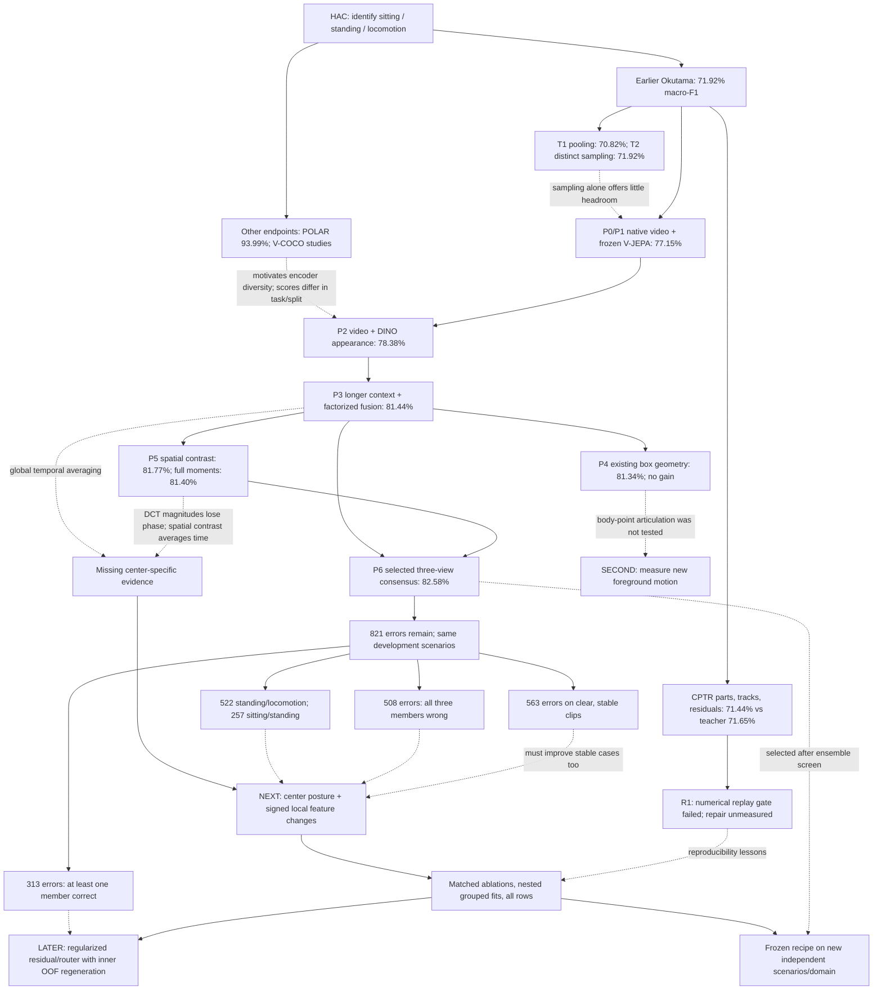

# HAC research map and next-phase decision

Prepared 2026-09-07 following independent reviews of experiment lineage, remaining
errors, and architecture design. This document proposes the next implementation;
this review trained no model. The analysis script verifies retained source hashes
and reproduces results on the same 4,977 centers from 444 tracks, 21 recordings, and
11 development scenarios.

## Decision

Keep the P6 consensus as the current reference. The next primary experiment should
test a small **center-aware posture and temporal-change expert** using existing
frozen video/image features. Its purpose is to recover information about the labeled
instant that current averages discard, including stable standing/walking differences.
Target 84% macro-F1 as the next engineering milestone and 85% as a stretch objective.
These are targets, not predicted outcomes.

Run a bounded camera/foreground correspondence pilot only as the second research
branch. Pursue a learned residual or router only after a new expert demonstrates
useful error corrections under grouped evaluation. Prepare independent evaluation
in parallel with development; the previous independent-replication milestone remains
unfinished.

## Mind map: evidence, failures, and the next questions

Solid arrows below show experiment lineage or a planned dependency. Dotted arrows
show an inference or motivating observation; they do not establish causality.

## What each experiment actually established

| Experiment | Macro-F1 | Interpretation and decision |
| --- | ---: | --- |
| Original distinct-frame teacher | 71.92% | Starting comparator for the current Okutama endpoint. |
| Historical CPTR | 71.44% vs teacher 71.65% | Added heads shared most errors; baseline preservation also needed repair. |
| R1 CPTR replay | No new metric | GPU numerical reproduction gate failed; a failed run is not a negative model comparison. |
| T1 arithmetic pooling | 70.82% | Better probability loss and cached-head speed; worse classification. |
| T2 repeated / distinct | 71.58% / 71.92% | Small sampling gain, uncertainty includes zero. |
| P1 real video / repeated center | 77.15% / 63.65% | Strong evidence for distinct video observations. This does not isolate pure physical motion from additional appearance. |
| P1 attentive real-video head | 76.18% | Lower F1 and worse NLL than the linear probe; increasing attention capacity alone is poorly supported. |
| P2 video + DINO | 78.38% | Appearance and video evidence complement each other. |
| P2 + motion summaries / factorized | 78.37% / 78.22% | These additions did not improve the mixed direct probe. |
| P3 long video alone | 80.43% | Longer video is a useful observation change. |
| P3 dual-scale video only | 79.48% | More concatenated features can make performance worse. |
| P3 dual-scale video + DINO / factorized | 80.72% / 81.44% | Best P3 exceeds P2 by 3.06 pp; factorization's isolated gain remains uncertain. |
| P4 compensated box trajectory | 81.34% | Best added-geometry arm is below the 81.44% refit. Retire this specific branch. |
| P4 raw/compensated head average | 81.03% | Averaging these two camera references did not help. |
| P5 spatial / temporal / combined factorized | 81.77% / 81.18% / 81.40% | Spatial contrast is a small lead; the declared combined-moment primary candidate failed to improve. |
| P5 combined direct head | 81.38% | Higher accuracy does not imply higher macro-F1; decoder comparison is also confounded by differing input features. |
| P6 diverse / spatial sensitivity triads | 82.58% / 82.57% | Effective probability averaging selected after inspecting development results. |

The POLAR 93.99% result concerns a different four-class static endpoint. Historical
fixed-validation and selective-coverage results also belong outside this progression.
The original plan used P4/P5 to denote repeated-seed and independent evaluation;
subsequent work reused those names for other experiments. The original evaluation
milestones have not been completed by reaching the phase name P6.

Earlier development screens also tested the following ideas. Their comparison
conditions differ, so these deltas describe local experiments rather than a common
ranking of algorithms:

| Earlier trial | Recorded local effect | Current relevance |
| --- | ---: | --- |
| Static to temporal teacher, fixed validation | 74.14% to 78.06% | Motivated new temporal observations. |
| Camera compensation over raw box trajectories | +0.144 pp F1 | Small geometry signal; not evidence for articulated point motion. |
| Dual temporal clocks | -0.716 pp F1 | More context needs a matched duration control. |
| Original / refined counterfactual objective | -2.449 / -0.810 pp F1 | Destroying motion and prescribing arbitrary labels was ineffective. |
| Masked feature pretraining | -0.624 pp F1 | No positive evidence in that screen. |
| GroupDRO | -0.234 pp F1 | No positive evidence in that screen; not a general rejection of group robustness. |
| Top-block LoRA | -3.018 pp F1 | Large backbone adaptation was a poor use of these limited development groups. |
| V-COCO mixed linear features / full stack | +0.971 / +1.534 pp over DINO flat | Motivates representation diversity; the extra stack's isolated gain is uncertain. |
| Continuation V0 SVM | Iteration ceiling; no prediction metric | Execution failure, not evidence that SVMs cannot work. |

R0/P0 materialization, identity checks, and frozen-feature caching enabled controlled
comparisons; they have no standalone classification score. The failed CPTR replay,
SVM run and other numerical gates remain recorded as failures rather than being
silently replaced by later trials.

The strongest P3-versus-P2 contrast is +3.06 pp macro-F1, scenario-bootstrap 95% CI
[+1.45,+5.10], within-phase Holm-adjusted exact p=0.0293. P3 factorization versus its
direct mixed-feature control is +0.72 pp, CI [-0.87,+2.60]. P5 spatial versus refit is
+0.32 pp, CI [-0.68,+1.16]. These last two comparisons do not establish the independent
benefit of the named architecture components.

P6 versus P3 is +1.14 pp, CI [-0.32,+2.51], Holm p=0.21875. P6 was chosen after a
screen of 28 equal pairs, 56 equal triples, and a pair-weight screen with 19 values. Its replay
verifies the chosen result, while the selection history limits the inference.
P6's component error correlations are 0.599-0.638; this is descriptive evidence of
complementarity, not proof of statistically independent experts or a causal mechanism.

## Remaining error budget and correlations

| Diagnostic | Result | Implication |
| --- | --- | --- |
| Total P6 errors | 821; accuracy 83.50%, macro-F1 82.58% | Aggregate target is close, but errors are structured. |
| Standing versus locomotion | 522 errors; 63.6% | Principal temporal/behavior boundary. |
| Sitting versus standing | 257 errors; 31.3% | Posture evidence still matters greatly. |
| Sitting versus locomotion | 42 errors; 5.1% | Low priority as a separate specialty. |
| All three members wrong | 508 errors; 61.9% | Better use of existing choices cannot by itself explain most errors. |
| At least one member correct | 313 errors; 38.1% | There is room for safer fusion, but no trained router has demonstrated it. |
| No transition/occlusion flag | 563 errors among 4,210 rows | 68.6% of errors are clear/stable under the old flags. |
| Three members agree | 469 errors among 4,092 rows | Agreement is not correctness or calibrated confidence. |
| Three members disagree | 352 errors among 885 rows | 39.8% error rate: a useful diagnostic, not an automatic routing rule. |
| Scenario 2.11 | 135 errors; F1 63.03% versus P3 66.60% | P6 regresses on an important subgroup. |
| Scenario-level comparison | P6 improves 7, ties 1, worsens 3 | The pooled gain does not generalize uniformly across scenarios. |

P6 rescues 189 P3 errors and introduces 136. Its largest mechanism opportunity is
therefore **useful correction with controlled harm**, while adding evidence that can
also repair the 508 shared failures. Because class supports and scenario sizes vary,
scenario F1 and pooled F1 must both be reported; they are not interchangeable.

Under a proportional, no-new-error repair of every off-diagonal confusion cell,
84% would require about 67 repairs; 85% about 114. This is a fractional planning
calculation, not a claim that any arbitrary 114 examples suffice or that such repairs
are attainable. Reaching 85% by correcting only transition-flag mistakes would require
roughly 88% of those mistakes to disappear without harm elsewhere.

The transition flag measures provider action variation in the original short window.
It can include Walking-to-Running changes already merged into one target class, and
does not establish a target-class boundary across the longer P3 input. Use it as a
diagnostic proxy. A new label audit should separately compute three-class transitions
on the exact authorized long windows, without changing the immutable center labels.

## Primary implementation: center-aware expert, P7

Research question: **Does preserving appearance at the labeled instant and changes
on either side improve posture and locomotion decisions beyond time-averaged frozen
features?** This tests information use inside the current representation. It does not
assume the center-aware signal is sufficient or label-causal.

Current P3 means pool every token time. P5 time-averages the spatial grid, and absolute
DCT coefficients suppress temporal phase/sign. The next expert should expose a few
fixed center features to the same regularized probe before adding neural capacity.

Feature proposal, fixed before fitting:

1. Start from P5's spatial-contrast posture inputs and P3's conditional-motion inputs.
2. Append DINO frame 8 minus the long-window DINO mean, and the spatial mean of V-JEPA
   tubelet 4 minus its window mean, to posture. Each contrast is 768-dimensional.
3. Append two 768-dimensional DINO feature-change vectors to motion: the signed
   central difference from frames 7 to 9 and center curvature relative to their mean.
   For h=4/30 seconds in long clips or 1/30 in fallback clips, define slope as
   (D9-D7)/(2h) and center curvature as [D8-(D7+D9)/2]/h^2. The latter is negative
   half the conventional second difference. These are derivatives of learned
   features, not calibrated physical velocity or acceleration.
4. DINO frame 8 is the labeled center. V-JEPA tubelet 4 contains frame 8 and frame 9;
   its tokens are already contextualized by the whole clip. It is a center-containing
   representation, not a pure center image or a causal/online observation.
5. Preserve all 4,977 rows. For the 467 incomplete long clips, use the existing exact
   short fallback and its own timestamps. Never shift a clip to a label boundary.

| Arm | Question isolated |
| --- | --- |
| A0: P5 spatial refit | Does the existing control reproduce under the current runner? |
| A1: A0 + center posture | Is averaging away the labeled posture harmful? |
| A2: A1 + signed local changes; primary | Does center-relative temporal structure add value? |
| A3: Same dimensions, fixed off-center anchor | Is any gain specific to the labeled instant rather than extra feature capacity? |
| A4: Same center features, unsigned local changes | Is sign/phase useful, or are ordinary local magnitudes enough? |
| A5: Direct multinomial on the exact union of A2 inputs | Does factorization with head-specific feature allocation help when total information is identical? |

For A3, declare DINO anchor slot 4 and neighbors 3/5, with V-JEPA tubelet 2. Keep
feature widths and feature normalization identical to A2. A4 takes magnitudes of
both A2 local-change vectors. Reversal is a diagnostic: these broad action labels
usually need motion presence, not forward/backward direction. A signed-feature gain
must not be casually interpreted as learning the true direction of locomotion.

Use the existing four C values (1e-5, 1e-4, 1e-3, 1e-2), balanced logistic heads,
training-only standardization, five outer scenario folds, and three inner grouped
folds. This retains a matched A0 control. Five factorized arms at 26 fits per outer
fold plus one direct arm at 13 give a maximum of **715 estimator fits**.
The A2 posture/motion dimensions are 11,520/6,144; the deduplicated union for A5 is
16,128. Do not repeat P5's direct-control omission of short/long motion summaries.
A2 versus A5 is not a pure decoder isolation: A2 assigns different subsets to its
two heads. Isolating only the decoder would require giving both binary heads the
full union, an additional arm outside this first bounded study.

A small label-independent resource pilot will measure feature memory and runtime
before scheduling the full pass. Existing P5 workload receipts total approximately
713 seconds of fitting; this is a cost reference, not a forecast for P7. P7 uses the
cached tensors and requires no video download or backbone training.

Predeclare the two system outputs in addition to the six experts: the original P6
reference and a three-view mean that replaces its combined-moment expert with A2,
retaining the long V-JEPA and dual-scale V-JEPA+DINO members and equal weights.
This tests improved center-specific evidence at the same ensemble size without
choosing weights from outer scores. The primary system contrast is this fixed
replacement triad versus P6. A2 versus A1
tests the temporal mechanism; A1 versus A0 tests the center-posture mechanism;
A2 versus A3/A4/A5 tests center alignment, signed information, and the combined
factorization/feature-allocation design.
Declare this six-comparison family before any P7 result; report every arm.

## Evaluation and decisions

Keep macro-F1 on all rows as the primary endpoint. Report accuracy, per-class F1,
NLL, Brier, scenario/fold results, long-input failure slices, and rescue/harm counts.
Use the existing scenario-bootstrap and whole-scenario swap method with a declared
comparison family. Its intervals describe this development population; they do not
remove the adaptivity accumulated across phases.

Engineering continuation criteria for the primary system:

- Reach at least 83.5% macro-F1 (a practical screening threshold) with lower NLL and
  Brier than P6. The next milestone remains 84%, with 85% the stretch objective.
- Improve macro-F1 in at least 7 of 11 scenarios, with no scenario loss exceeding
  2 percentage points. These are proposed engineering guardrails, not a power-derived
  significance rule. Publish any failure, including the difficult small-support groups.
- Report rescues among the 508 rows where all P6 members were wrong, and positive
  net corrections across all rows and in clear/stable clips. These are mechanism diagnostics;
  do not route on true error status or annotation flags.
- For an architecture claim, A2 must beat the matched off-center/unsigned controls
  with uncertainty reported, and retain an advantage after independent evaluation.
  If an ordinary control matches it, retain the simpler explanation and method.

Select hyperparameters inside outer training groups. If a later stage learns fusion,
calibration, residuals, thresholds, or gates, regenerate its component predictions
inside that outer training population. The existing global OOF matrix cannot safely
serve as training input for a newly cross-fitted stack: some of its component models
were trained on the new outer holdout. Calibration or meta-hyperparameter selection
also needs held-out groups inside that training population. Never reuse outer labels
to select experts, weights, epochs, or stopping rules.

For fixed P7 experts, the current nested probe procedure is sufficient; no stacking
fit is needed for the fixed replacement triad. Repeating deterministic logistic fits
with different estimator seeds adds no meaningful evidence. After choosing one fixed
recipe, repeat grouped split assignments to assess sensitivity, and use multiple
optimization seeds only if a stochastic neural head is actually introduced.

## Subsequent actions, ranked

| Priority | Action | Condition to proceed and useful stopping rule |
| --- | --- | --- |
| 0, alongside P7 | Audit source identities, true target transitions, and independence of new evaluation videos | Preserve the current benchmark; establish a separately frozen evaluation population before using it. |
| 1 | Run the six-arm P7 trial and its fixed system comparison | Continue only if improvements survive the declared checks; record negative results without expanding the grid after seeing outer scores. |
| 2 | Test new foreground articulation/translation evidence | First run a label-independent, scenario/actor-size-balanced pilot of about 128 eligible clips. Measure visibility, forward/backward consistency, camera-only residuals and crop-to-scene coordinates. |
| 3 | Test a small bounded residual using the successful new expert | Compare fixed averaging, ordinary regularized fusion and residual correction on identical evidence. Regenerate training-only inner OOF references. |
| 4 | Independent replication and full input-to-prediction resource measurement | Freeze model, preprocessing, class mapping and failure policy before opening the new evaluation outcomes. |

The foreground-motion branch needs a correspondence-quality feasibility protocol
before full extraction. Use foreground points and background references, with actor
size and time normalization. Compare raw flow/points, ordinary compensated flow/points,
and multiple camera hypotheses on the same inputs. P4's two box-reference heads did
not perform this experiment. Abandon this branch if native actor detail is too poor
to measure reliable correspondences; upsampling cannot create missing observations.

External data should answer a specific question. Prefer independently recorded aerial
or surveillance clips with person tracks and trustworthy sitting/standing/locomotion
labels. Verify access terms, duplicate videos, scenario grouping and ontology first.
Separate auxiliary training footage from the external evaluation set before any
selection. [UAV-Human](https://sutdcv.github.io/uav-human-web/), NEC-Drone and TinyVIRAT
are candidates for this audit, not
guaranteed immediately usable substitutes. A new domain is not expected to inherit
the exact 82.58% number; report its absolute score and a matched reference improvement.

Deprioritize broad learning-rate/LoRA/GroupDRO sweeps, further box-trajectory fusion,
unrestricted attention heads, another large ensemble-weight sweep, and threshold
tuning on the exposed OOF set. Scalar temperature calibration alone preserves a
single model's argmax; it is a probability-quality control, not a direct F1 mechanism.

## Contribution and prior art

Current evidence supports an effective system assembled from established operations:
frozen pretrained encoders, logistic probes, hierarchical decoding, fixed token
statistics and probability averaging. OSTM and OCVC are useful local names; names
and a threshold crossing do not establish originality.

The potentially publishable question is narrower: whether preserving the labeled
instant in compact frozen-token features improves aerial posture/motion recognition,
repairs shared model errors, and transfers across recording conditions at low added
cost. The point-motion uncertainty branch remains another hypothesis if ordinary
compensated motion is insufficient. Both require matched controls and prior-art review.

Relevant primary sources:

- [V-JEPA 2.1](https://arxiv.org/abs/2603.14482): dense spatial and temporal features
  motivate examining the information discarded by the current probe reductions.
- [Long-Term Feature Banks](https://arxiv.org/abs/1812.05038):
  combining local observations with broader cached context is established prior art.
- [Actor-Centric Relation Network](https://arxiv.org/abs/1807.10982): actor evidence
  and surrounding context already have a substantial action-recognition literature.
- [AdaptFormer](https://arxiv.org/abs/2205.13535): small adaptations over frozen vision
  models are established, although its internal adapters differ from a cached-feature head.
- [ReZero](https://proceedings.mlr.press/v161/bachlechner21a.html): zero-initialized
  residual scaling is established and cannot be the standalone novelty claim.
- [Calibration of Modern Neural Networks](https://proceedings.mlr.press/v70/guo17a.html):
  calibrated confidence requires evaluation; agreement or averaging alone is insufficient.
- [Cawley and Talbot](https://jmlr.org/papers/v11/cawley10a.html): selecting methods
  against a finite validation population can overfit the selection criterion.

## Review artifacts and evidence trail

- [Reproducible analysis](../experiments/analyze_okutama_post_p6.py)
- [Analysis JSON](../.runs/research_20260907/post_p6_review/summary.json)
- [Phase table](../.runs/research_20260907/post_p6_review/phase_metrics.csv)
- [Scenario table](../.runs/research_20260907/post_p6_review/scenario_metrics.csv)
- [Evidence figure, PNG](../.runs/research_20260907/post_p6_review/evidence_overview.png)
- [Evidence figure, PDF](../.runs/research_20260907/post_p6_review/evidence_overview.pdf)
- [Earlier engineering review](HAC_ENGINEERING_RESEARCH_REVIEW_20260906.md)
- [Continuation execution report](HAC_CONTINUATION_EXECUTION_REPORT_20260907.md)
- [P1 results](HAC_OKUTAMA_VIDEO_P1_RESULTS_20260907.md)
- [Earlier breakthrough plan](HAC_BREAKTHROUGH_RESEARCH_PLAN_20260907.md)
- [P4 protocol](../experiments/okutama_video_p4_protocol.json)
- [P5 protocol](../experiments/okutama_video_p5_protocol.json)
- [P6 selection disclosure](../experiments/okutama_video_p6_protocol.json)

This review reads only named development artifacts and existing source documents.
It does not change historical experiments, their locks, labels, or evaluation roles.
New P7 execution requires a fresh protocol derived from this plan; this document is
the design for that implementation, not a declaration that those new trials ran.
