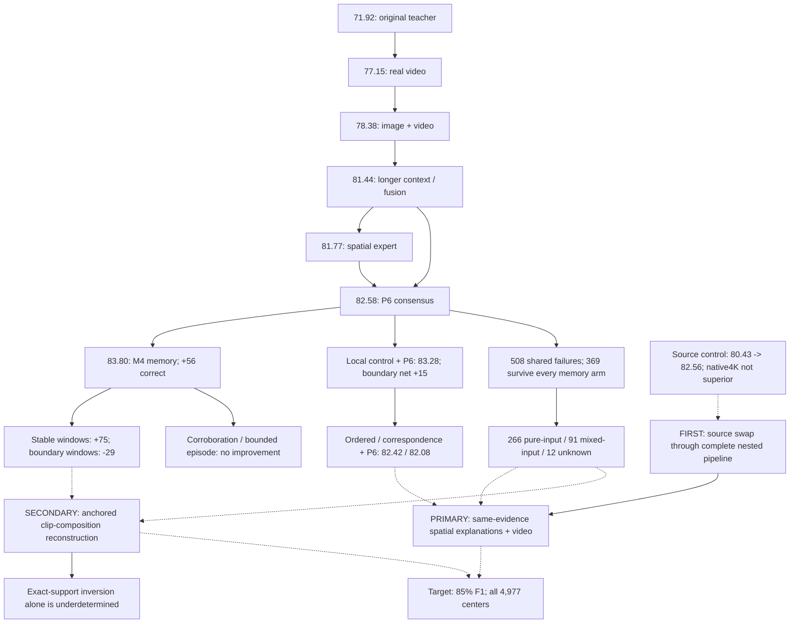

# HAC: shared-evidence reconstruction and the next experimental phase

Date: 2026-09-08. Status: team-reviewed research design, not an executed training
protocol. This review performs read-only diagnostics and writes analysis artifacts;
it trains no model and changes no previous experiment. Publication preparation is
out of scope. Working architecture names below do not claim worldwide novelty.

## Decision

The next phase should improve the observations and the way a class explanation is
constructed, rather than primarily changing how existing predictions are averaged.

1. Execute a controlled **source-input swap** through the complete nested P6/M4
   pipeline. This is the strongest measured enabling intervention.
2. Build **Shared-Evidence Actor Reconstruction (SEAR)**: a dense center-frame
   posture/explanation head whose competing class templates must use the same
   evidence, matchability and viewpoint-adjustment budget. Retain identical video
   context for recognizing locomotion. This is the primary architecture hypothesis.
3. Separately test whether **existing frame-level supervision** improves an ordinary
   frame head before attributing any benefit to a more elaborate architecture.
4. Keep **anchored clip-composition reconstruction** as a bounded, transition-specific
   experiment. The team's exact-timestamp audit rejects naive occupancy-only inversion.
5. Reserve center-anchored multiframe feature reconstruction for a later information
   recovery experiment. Do not combine all proposed mechanisms in the first model.

Our objective is 85% macro-F1, with 84% as the first milestone, on all 4,977 original
centers. Best measured performance remains M4's 83.8046%; these targets are not
forecasts. Historical P6 at 82.5830% remains the retained reference. M4 is the best
exploratory candidate, not a model that passed every promotion guardrail.

## 1. Aerial view: what improved and what did not

Scores in the central lineage use the retained three-class Okutama development
endpoint. Other datasets, earlier validation protocols and label-oracle outputs
must not be placed on this same leaderboard.

| Experiment family | Measured result | What the next design should learn from it |
| --- | --- | --- |
| Original distinct-frame teacher | 71.92% F1 | Starting point; sampling changes alone were small. |
| P1 real video / repeated-center video | 77.15% / 63.65% | Distinct observations and video representations matter; this does not isolate pure motion from extra appearance. |
| P2 video plus DINO appearance | 78.38% | Image and video evidence complement one another. |
| P3 longer context / final fusion | Video alone 80.43%; system 81.44% | Useful information arrived through duration and representation; the isolated factorization gain was uncertain. |
| P5 spatial / temporal / combined moments | 81.77% / 81.18% / 81.40% | Spatial layout is a lead; more temporal summary features did not automatically help. |
| P6 diverse consensus | 82.5830% | Complementarity helped, but the system still made 821 errors, including 508 shared by every component. |
| Fixed neighboring mean / M2 / M3 | 83.0792% / 83.5112% / 83.3230% | Neighboring observations contain usable evidence; ordinary sequence models are strong controls. |
| M4 survival memory | 83.8046%; 248 rescues / 192 harms versus P6 | Best current F1, especially on stable observations; the claimed transition-safety mechanism was not established. |
| M5 corroboration / fixed M2-M4 consensus | 82.9482% / 83.7681% | Extra corroboration lost F1; the fixed consensus improved losses, not M4's F1. |
| Episode v2 / matched control | 83.4801% / 83.6304% | Better-calibrated hazards and a valid direct-coefficient bound did not improve classification or boundary safety. |
| Pooled / temporal / ordered / correspondence heads, each blended with P6 | 83.2799% / 82.8006% / 82.4172% / 82.0771% | The simple spatial control won this comparison; coarse relational invention did not. |
| Source-only global video probe: supplied / native4K / regenerated downsample | 80.4254% / 82.1686% / 82.5642% | Source regeneration is productive; extra native resolution did not outperform matched downsampling. |

Earlier negative results remain relevant: CPTR was 71.44% versus its 71.65% teacher
in that comparison; P4 box motion reached 81.34%; P7 center/signed-feature replacement
82.5350%; P8 camera-compensated point-summary replacement 82.6269%, with no shared
failure repairs by the system. Local counterfactual-loss, masked-pretraining,
GroupDRO and LoRA screens were also negative. These reject those tested recipes,
not entire method families. Failed replay/SVM computations have no new accuracy
result and are not scientific evidence against their unexecuted interventions.

The historical POLAR 93.99% and V-COCO results belong to different tasks/evaluation
settings. They inform transfer ideas, not the present target score.



Solid arrows show lineage, containment or a planned dependency. Dotted arrows
motivate hypotheses; they do not establish causal explanations or additive gains.

## 2. The new error audit changes the priority

Definitions matter. The old comparable boundary slice uses 671 complete sampled
long windows. The new node-purity audit uses the actual union of sampled short and
long input timestamps: usually 28 distinct actor/frame observations, or 16 with
short fallback. It finds 682 mixed, 4,184 pure and 111 unknown node supports. This
is different again from labeling every intervening frame in a continuous interval.

| New diagnostic | Finding | Decision consequence |
| --- | --- | --- |
| All four memory models wrong | 599 rows: 510 original P6 errors and 89 P6-correct rows harmed by all four | Count genuine new repairs separately from undoing memory damage. |
| Persistent historical shared failures | 369: 266 pure-node, 91 mixed-node, 12 unknown | About 72% do not have a mixed sampled input. Transition handling cannot be the entire breakthrough. |
| Local pooled-P6 versus M4 on mixed nodes | 102 local-only correct versus 58 M4-only | There is a targeted within-clip mixing problem. |
| Same comparison on pure nodes | 135 local-only versus 220 M4-only | Broadly replacing memory with the local expert would lose stable corrections. |
| Pure node, but mixed neighboring memory interval | 56 local-only versus 66 M4-only on 851 rows | The local advantage is not simply explained by any transition somewhere in memory. |
| Medium-sized, pure-node persistent errors | 164 rows; P6 predicts all 43 sitting examples and 64/68 locomotion examples as standing | Build stronger posture and movement evidence, not only a boundary detector. |
| New sources on 266 pure persistent errors | Regenerated spatial contrast repairs 52; raw local model repairs 35 | There is tangible visual-information opportunity in stable cases. |
| Correct nearby P6 observation among persistent failures | 123/369 | New pixels are not universally necessary; retrieval still has room. |

Mixed standing examples account for 37 of the local expert's 44 net advantages on
mixed nodes. A descriptive scenario/class/size-stratified odds ratio is 3.13 for
local success on disagreements in mixed versus pure nodes. This is association,
not a causal estimate or a rule for routing at inference.

The pooled-P6 model corrects 249 M4 errors, but 157 were already correct in P6;
only 92 repair original P6 errors. A claim of 249 newly solved hard examples would
therefore be misleading. Likewise, among all audited new families, 232 of the
369 persistent shared failures remain unresolved. Majority-stable, medium-size
failures survive; "small people need more pixels" is not a sufficient diagnosis.

### What the correlations actually support

M4's error correlation with the expected-episode model is 0.856, versus 0.526 with
the pooled local head and about 0.567 with regenerated-source global video. These
visual heads offer more different corrections, but each also loses more M4-correct
rows than it uniquely repairs. Low correlation is an opportunity, not an ensemble.

Regenerated spatial contrast versus supplied-source spatial contrast has 252
rescues / 147 harms. Among P6 errors specifically it has 113 / 30. The improvement
spans all classes and nine scenarios, although three scenarios supply 74/105 net
corrections. Its apparent small-actor advantage is modest after stratification.
Native4K versus regenerated downsample repairs 69 versus 68 of the persistent
369, with 50 overlapping repairs. The data supports regeneration, not a resolution
superiority claim.

## 3. First executable experiment: the source-input swap

Use the verified exact-downsample source condition. Replace the corresponding
long V-JEPA feature streams and derived statistics in P6 and M4; retain original
short-video/image streams, crop support, class mapping, neighbors and every center.
Audit which P6 components actually consume each changed feature. Do not silently
replace DINO, change duration or introduce additional labels in this comparison.

Rebuild every affected base fit and inner prediction within its own training
population. The existing 58-population/3,016-fit base pipeline is the implementation
template; cache reuse requires exact feature/source/training-identity matches.
Historical global OOF values must not become training inputs for a new stack.

Compare old-source and new-source P6 and matched M4. Reverify the old source's
prediction replay, then use the same two-arm M4 settings and three seeds. Budget
up to 150 neural fits and approximately one new 3,016-estimator base generation;
the exact dependency audit may permit legitimate unaffected-member reuse.

Preserve all 467 short-context fallbacks and the 29 whole-clip source fallbacks.
The source input improvement is already measured in an isolated probe; its effect
inside the complete system remains unmeasured. Never add +2.14 source points to
83.80 memory F1 to predict a combined score.

## 4. Primary invention: Shared-Evidence Actor Reconstruction

### What changes

Existing DINO extraction retains one CLS descriptor per frame. The pinned model
actually emits a 27x27 grid of 768-dimensional patch descriptors at 384px. The new
head retains this spatial field from the exact center image. It does not require
a new backbone or anatomical keypoint detector.

The model extracts six latent visual slots and one unmatched/background channel
once per image, independently of the candidate class. Slot descriptors, positions,
spatial spread and matchability are shared by all class hypotheses. A common
image-derived, bounded nuisance transform handles crop-scale/orientation changes.
No class receives a more permissive deformation or missing-evidence allowance.

Each class has four learned appearance/layout templates to accommodate visual
variation without scenario IDs or other-drone identities. A working class energy is:

```text
E(class, template) = descriptor mismatch on shared slots
                  + directed relative-position mismatch

local_class_score = negative soft minimum over that class's templates
final_logits      = local_class_scores + common video-context logits
```

Every unary cost uses the same observed-slot mass for every class/template; pairwise
costs use the same joint matchability. Normalize descriptor/cost scales consistently
and share their positive weights and temperature across classes. Forbid
class-specific salience, mask suppression or cost-scale reductions that could
reintroduce the hiding privilege. An unobserved slot contributes zero evidence,
not a mismatch against a zero-filled descriptor. Fully missing local evidence
produces exactly equal local logits and exact video-only fallback predictions.

Missingness/deformation restrictions are shared constraints and training regularizers,
not an identical additive term claimed to change class probabilities: such a term
would cancel in the final softmax. Shared constraints guarantee equal evidence
offered to competing classes, not that the shared mask retained every genuinely
informative patch or that the class prediction is correct.

The common video branch receives identical frozen short/long video evidence in
every comparison arm. A center image alone is not assumed to distinguish standing
from locomotion. The complete model generates new class logits from visual
evidence; it is not restricted to a convex mixture of old neighbor predictions.

The specific hypothesis is **same-evidence competition**: an incorrect explanation
cannot lower its energy by independently dropping inconvenient patches, assigning
them to an occluder, or choosing an arbitrarily flexible viewpoint transformation.
Class-specific appearance/layout remains learnable; nuisance privileges do not.

Slots are learned visual roles, not certified torso/knee/foot landmarks. DINO patch
features are spatially contextual, not literal independent measurements of body
parts. Matchability is not automatically a calibrated physical-occlusion estimate.

### Why this is not a repeat of an earlier result

- P7 retained global frame descriptors and signed feature differences. It did not
  test dense center-patch explanations under shared evidence constraints.
- The coarse ordered trial used 3x3 contextual video grids. Its negative result
  motivates a same-input plain dense model, not confidence that the custom head wins.
- The existing fine-detail prototype computes nonlinear moments before pooling,
  but still discards positions inside each macroregion after those summaries.
  SEAR retains those spatial relationships through its explanation cost.
- CPTR's failure is a warning against assuming named parts create value. The new
  mechanism must beat plain dense heads; no untested explanation of CPTR's failure
  is needed to justify a controlled new comparison.
- M4/M5/episode operate primarily on class-probability borrowing. Shared-evidence
  reconstruction changes the class evidence itself, while retaining video context.

### Proposed matched matrix

| Arm | Computation | Question |
| --- | --- | --- |
| A0 | Center CLS plus common video branch | What does the matched source/center evidence achieve without retaining patches? |
| A1 | Ordinary dense patch CNN plus common video | Does stronger spatial information suffice? |
| A2 | Ordinary patch transformer plus common video | Does generic learned spatial computation suffice? |
| A3 | Unconstrained class-specific template/visibility model | Do shared evidence and nuisance constraints matter? |
| A4 | Shared-evidence template model without relative geometry | Does topology matter beyond prototype appearances? |
| A5, primary | Full shared-evidence appearance and geometry energy | Does the proposed computation improve the strongest controls? |

All arms use the same source, center images, video context, center-label population,
augmentations, class balancing and inner selection. A0 intentionally removes patch
information; A1-A5 have matched dense inputs. No extra frame labels, occupancy loss,
memory gate or backbone fine-tuning is bundled into this first architecture matrix.

Prototype defaults: rank32, six slots, four templates/class, three refinement
iterations, fewer than one million active trainable parameters. Match active
capacity within approximately 5% for the dense mechanism comparisons, using real
computation rather than unused parameter padding. Exact counts and one common
batch size are fixed after a label-blind resource pilot, before classifier fits.

Six arms imply 450 neural fits with five outer folds, three inner folds, four
optimizer configurations and three outer seeds. Existing 30-epoch/early-stopping
limits are a starting budget, not an invitation to extend runs after seeing results.

Freeze these six directional contrasts before fitting: A1-A0, A2-A0, A5-A1, A5-A2,
A5-A3 and A5-A4. Use one six-contrast Holm family and scenario-block uncertainty.
The primary head must beat both ordinary dense controls, not an outer-selected
"strongest" comparator. The first two contrasts isolate dense-information gains;
the last four challenge the custom mechanism.

### Feasibility and numerical gates

- Extract dense center tokens to a new cache. Approximately 5.19GiB stores all
  4,977 raw 27x27 float16 grids; this excludes ancillary metadata.
- Replay existing CLS outputs on the supplied-source condition before extracting
  any new-source center condition. Freeze the model, crop/normalization and exact
  384px/patch14 contract; do not silently change resolution to get a neater grid.
- Measure extraction throughput and every head's forward/backward memory on a
  fixed label-blind pilot. Target below 4GiB head-training peak allocation and a
  common feasible batch; provide an actual runtime estimate before scheduling.
- Verify all logits and gradients are finite; class scores use the same matchability,
  nuisance and cost-weight tensors. Test low-coverage behavior and exact all-missing
  video fallback; do not claim that learned matchability establishes true visibility.
- Check slot-collapse and correspondence stability. Joint permutation of observed
  slots and template slots must preserve energies; stable slot roles or explicit
  permutation-consistent matching are required.
- Predeclare any slot compactness, transform-consistency and batch-level diversity
  regularizers identically for A3-A5. Do not force every slot to exist in every image.
- Hold crop jitter, coordinate shuffle, image-context masking and video-branch
  removal as fixed diagnostics, not score-selected inference modifications.
- Preserve every row. With unusable local evidence, the declared common video
  fallback must still predict; no difficult-case exclusion is permitted.

## 5. Separate supervision experiment: learn from already observed frames

The cached supports contain 115,395 unique recording/track/frame identities,
including 110,418 noncenter identities. There are 112,813 unique identities in
fully known node supports. These counts do not mean that every possible dense
annotation frame has a cached image feature, or that nearby frames are independent.

Short and long DINO caches each retain per-frame CLS features. Start cheaply with
two identical frame heads: center-only supervision versus valid additional cached
frame supervision. Apply the same video-context/center decoder to both, and keep
that experiment distinct from the dense-template matrix. Training frames and all
class weights are drawn only from the corresponding training scenarios.

Deduplicate physical actor/frame identities; if the same frame was cropped
differently in different clip contexts, retain those crop variants explicitly and
share a physical-frame weight budget rather than assuming feature equality. Cap
per-track contribution so long tracks do not dominate. Mask ambiguity and missing
annotations. Dense labels supply supervision, not missing pixels or new scenarios.

If an ordinary frame head captures the gain, retain it. Later architectural
comparisons must give their controls the same extra supervision. Do not call this
a new architectural benefit merely because it is trained inside a named model.

## 6. Creative but bounded: anchored clip-composition reconstruction

The motivation is specific: local evidence beats M4 predominantly when the input
clip itself mixes target states. Predicting an accurate boundary after such a clip
has been compressed does not necessarily restore its center's state.

Train a NEW observation head separately for each encoder stream to predict the
three-class histogram over that stream's actual selected timestamps. Do not assume
P6 predicts this histogram; do not equate the 28-frame union purity target with
either 16-frame stream's occupancy. If any required target is unknown, mask that
occupancy target rather than redefining the input support using known labels only.

Let H encode exact sample membership and Q be latent state distributions at source
timestamps. A bounded structured estimate could minimize:

```text
framewise emission cost(Q)
  + lambda * composition mismatch(HQ, predicted clip compositions)
  + modest, time-aware state-variation penalty(Q)
```

Use a fixed small unrolled simplex solver, such as eight mirror-descent steps,
with a framewise center anchor. These overlapping factors form a composite
objective, not automatically a calibrated generative posterior. Deduplicate exact
observations and test duplicate invariance; span overlap alone is not shared pixels.

### The team's falsification of the naive version

One-second centers shift 30 provider frames, whereas long clips sample at stride4.
Consequently 3,334/3,704 adjacent valid effective-clip pairs share no exact sampled
frames; this denominator includes historical short fallbacks. In 590 centers with
all five slots full-long (the center plus four neighbors), the support union has 77
timestamps, H has rank5, and the center's column is identical to 13 other columns.
Thus five occupancy vectors cannot by themselves recover the center's state.

The **unanchored occupancy-only model is rejected now**. An anchored variant must
pass synthetic ambiguity, nullspace, constant-state, missing-support and
incorrect-anchor tests before real training. It must improve recovery with noisy
anchors relative to ordinary temporal regularization, not merely reconstruct an
ideal label-generated histogram. If the benefit requires unrealistically exact
occupancy estimates or assumes a single change where data violates that assumption,
stop this branch.

If it passes, compare an ordinary temporal decoder, that same decoder with matched
occupancy auxiliary supervision, and the structured composition model using the
same emissions, labels and context. A useful ordinary segmentation/duration model
is also a required reference if duration constraints are introduced. Do not credit
the inverse mechanism for a supervision or temporal-prior improvement.

## 7. Later invention: reconstruct visual evidence before classification

If the dense center head succeeds but errors remain visibility-dependent, test a
center-anchored multiframe feature reconstruction model. Align nearby framewise
patch observations into the center's coordinates, keep correspondence uncertainty,
and retain the untouched center evidence. Train against actual held-out center
patches or independently extracted framewise features, not fabricated action labels.

Withhold reconstruction targets before the student's feature encoding, or use
independently encoded neighbor-only inputs. Masking patches after full-frame DINO
encoding leaks target appearance through contextual features; providing the entire
target also permits identity copying. The untouched center may remain available
to a separate classification branch, not to the target-prediction input.

Compare center-only reconstruction, unaligned multiframe reconstruction and aligned
reconstruction with identical observations/capacity. A class score must not improve
by hallucinating attractive details that are inconsistent with observed source
frames. Require correspondence consistency, held-patch reconstruction and downstream
classification gains; visual sharpness alone is not the target.

Framewise targets are essential. Contextual V-JEPA clip tokens cannot be called
leak-free forecast targets. An estimator that sees both endpoints is doing
reconstruction, not forecasting. Existing P8 camera compensation can be reused
as measurement machinery, but its coarse residual-summary classifier remains rejected.

Cross-drone teachers stay gated off until synchronization and same-actor matches
are verified. Additional web video is lower priority than these controlled
in-domain interventions; any later external dataset needs an explicit compatible
auxiliary target, terms/access review and separate training/evaluation identities.

## 8. Execution order, success criteria and stop rules

| Stage | Deliverable | Budget/decision |
| --- | --- | --- |
| 0 | Freeze this phase's data/dependency map and new protocols; preserve old results | No classifier fits; distinguish source, representation, supervision and decoder changes. |
| 1 | Old/new source P6 and matched M4 | Up to 150 neural fits plus required new nested base fits; do not assume isolated source gains compose. |
| 2 | Dense center cache and SEAR mechanism pilot | Zero classifier fits; exact CLS replay, shared-evidence checks, finite gradients and measured compute. |
| 3 | Six-arm dense-center comparison | Up to 450 fits; all arms reported, source/context/labels matched. |
| Parallel to 2 | Ordinary cached-frame supervision comparison | Separate two-arm protocol; no patch-cache expansion to every dense frame initially. |
| Conditional | Anchored composition synthetic test, then a small matched matrix only if useful | Unanchored variant already rejected; do not start a full inversion matrix merely because code exists. |
| Later | Joint source/local/memory system, then evidence reconstruction if justified | Newly nested full pipeline; no outer-selected weights or sum of separate gains. |

The primary architecture must beat the ordinary dense heads and the specific
unconstrained/geometry-off controls. A suggested practical effect target is at
least 0.5 macro-F1 points over the strongest matched ordinary head, with positive
net corrections and no NLL/Brier regression; this is an engineering threshold,
not a power calculation. Failure to beat a plain CNN means retain the CNN's gain
and reject the custom mechanism, not enlarge the template bank after outer scores.

For the full system, report F1 against both P6 and M4, per-class F1, NLL, Brier,
rescues/harms, seed means and individual seeds, scenario behavior, all fallbacks,
legacy boundary/stable strata and exact node-purity strata. Aim for 84 then 85 F1,
improvement in at least 7/11 scenario accuracies, no scenario loss over 2 accuracy
points, and fewer than the fixed smoother's 73 legacy-boundary harms. A new local
mechanism should also repair pure persistent errors, not only undo M4 damage.

Keep masks diagnostic/supervisory only: true action boundaries, true errors and
the persistent 369 list are never inference-routing features. Do not oversample
globally discovered outer errors. Hyperparameters, scalers, template initialization,
class weights, extra-label sampling, calibration and any learned fusion belong
inside the relevant training groups. Report paired scenario uncertainty and the
declared comparison family, while acknowledging repeated development reuse.

M4's confusion matrix contains 765 errors. A label-only sensitivity calculation
that proportionally repairs each off-diagonal cell with zero new harms needs about
9.25 fractional repairs for 84% F1 and 56.60 for 85%. This describes the scale of the
gap, not an achievable model score or a claim that arbitrary 10/57 corrections suffice.

## 9. Research mechanisms used as controls and building blocks

These sources guide experiments; their published numbers do not predict an HAC gain.

- [V-JEPA 2.1](https://arxiv.org/abs/2603.14482) studies dense image/video features.
  It motivates testing retained spatial information, not assuming frozen tokens
  already express measurable physical velocities.
- [Slot Attention](https://arxiv.org/abs/2006.15055) provides competitive iterative
  slot allocation. A slot readout alone is not the proposed mechanism's novelty.
- [ProtoPNet](https://proceedings.neurips.cc/paper/2019/hash/adf7ee2dcf142b0e11888e72b43fcb75-Abstract.html)
  uses prototypical part evidence; template recognition is an established building block.
- [Deformable ProtoPNet](https://arxiv.org/abs/2111.15000) already learns flexible
  multipart templates. The proposed shared-evidence constraints require their own
  comparison rather than a claim that deformable prototypes are newly invented.
- [PDiscoNet](https://arxiv.org/abs/2309.03173) motivates consistency, compactness
  and diversity checks for learned parts without demanding every part in every image.
- [CompositionalNets](https://arxiv.org/abs/2003.04490) explicitly represents partial
  occlusion. Its existence reinforces the need for the unrestricted-template control;
  our shared matchability is not automatically a physical occlusion detector.
- [Pictorial Structures](https://www.cs.princeton.edu/courses/archive/spr08/cos598B/Readings/FelzenszwalbHuttenlocher2004.pdf)
  combines appearance and spatial relationships. The experiment must isolate our
  shared-evidence constraint rather than claim relative-position energies are new.
- [MS-TCN](https://arxiv.org/abs/1903.01945) is an ordinary temporal segmentation
  reference when considering a structured state decoder.
- [ASRF](https://openaccess.thecvf.com/content/WACV2021/html/Ishikawa_Alleviating_Over-Segmentation_Errors_by_Detecting_Action_Boundaries_WACV_2021_paper.html)
  separates frame classification and boundary regression. A boundary branch alone
  is established and, in our experiments, did not guarantee safe final classification.
- [Learning from Label Proportions](https://proceedings.mlr.press/v151/saket22a.html)
  motivates reasoning about bag-level composition and instance labels. Its guarantees
  do not automatically establish identifiability for noisy overlapping video observations.
- [Count-based weak supervision](https://papers.neurips.cc/paper_files/paper/2023/hash/79a0c8e7ae8e403e39341ea6b0ba4c21-Abstract-Conference.html)
  offers differentiable aggregate-count constraints. This does not repair the
  rank deficiency of our unanchored source-membership operator.
- [Recognition-oriented video super-resolution](https://arxiv.org/abs/1903.05577)
  motivates optimizing reconstruction for recognition rather than visual appeal.
  Our native/downsample result argues against making generic super-resolution the
  first intervention without a matched data/task test.

## Evidence trail and review status

Prior completed work: [execution report](HAC_MEMORY_MOTION_EXECUTION_20260908.md),
[original invention map](HAC_INVENTION_PLAN_20260908.md),
[historical research map](HAC_RESEARCH_MAP_AND_NEXT_PHASE_20260907.md),
[P7](HAC_P7_RESULTS_AND_P8_DECISION_20260907.md),
[P8](HAC_P8_CCAC_RESULTS_AND_P9_DECISION_20260907.md).

New diagnostics are preserved separately under
`.runs/research_20260908/next_phase_review_v1/`: `data_findings.json` and
`source_support_census.json`, with input hashes and reproduction logic. They create
no new classifier, fusion score or evaluation population.

Artifact SHA-256 values:

- `data_findings.json`: `9494643da23b0864bc0347b934183d5e501bb53728abf3ba3bb9e36a4143b16f`.
- `reproduce_data_findings.py`: `339f36cb789b0a3ca80c19073cd0f9c72204471984b65cea3e2025241d5a079f`.
- `source_support_census.json`: `778ef6483d1020d76b4030e429e3a310071f86f4281dc9c5bc51869871d02749`.

The main agent independently reran `reproduce_data_findings.py`; the complete
output JSON was bit-identical to the audited artifact. Architecture, data/evaluation
and prior-art reviewers each completed a full-plan review. Their material corrections
were incorporated: shared costs and exact fallback, fixed comparison family,
P6-versus-M4 error attribution, effective-support terminology, narrow visibility
claims and pre-encoding reconstruction-target isolation.

The team explicitly changed its recommendation during review: within-clip mixing
was initially attractive as a primary explanation, but the pure-error census and
exact-support rank audit showed why it is insufficient. The primary mechanism now
addresses stable visual evidence; transition reconstruction is a bounded companion.
This is a concrete next-phase plan, not a claim that these new architectures have
already improved 83.8046% or that a breakthrough is guaranteed.
