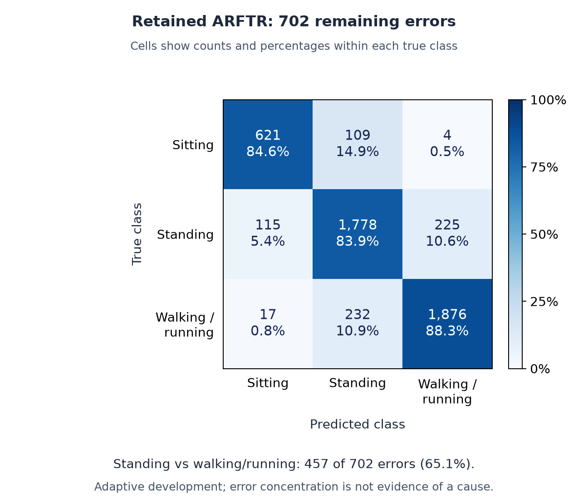

# Model card: retained ARFTR development system

## Purpose and status

Research software for coarse, person-centered human activity classification from
visual evidence. It supports methodological analysis and a reproducible engineering
portfolio; it is not a production service, safety-certified model, or general-purpose
activity-recognition product. No pretrained deployment checkpoint is shipped here.

## Inputs and outputs

ARFTR (Anchor-Restored Factorized Temporal Residual) consumes upstream M4, P6 and A3
probabilities plus same-track temporal metadata. Those upstream models use the
person-centric visual and actor-memory evidence prepared by the research pipeline.
It is not a single raw-video command-line classifier. Outputs are probabilities for **sitting**,
**standing**, and **walking_running** (walking and running combined).

The recorded temporal transform can use a +1-second neighbor as well as a -1-second
neighbor. It is an offline/look-ahead evaluation, not a validated zero-latency
streaming interface; upstream evidence can require additional context.

The [architecture guide](ARCHITECTURE.md) links the source and evaluation protocol.
Inference must not depend on annotation-derived support or held-out correctness.

## Evaluation

- 4,977 centers from 11 Okutama development scenarios, evaluated in five outer folds.
- Retained macro-F1: **85.383648%**; accuracy: **85.895118%**; errors: **702**.
- The development cohort was repeatedly used during architecture research; these
  numbers are not untouched confirmation or deployment estimates.
- Earlier POLAR, V-COCO, and temporal-confirmation results refer to different
  systems and evaluation populations, not additional validation of ARFTR.

See [metrics and confusion matrices](../results/arftr_development/metrics.json).

### Per-class behavior

| True class | Examples | Precision | Recall | F1 |
| --- | ---: | ---: | ---: | ---: |
| Sitting | 734 | 82.47% | 84.60% | 83.52% |
| Standing | 2,118 | 83.91% | 83.95% | 83.93% |
| Walking / running | 2,125 | 89.12% | 88.28% | 88.70% |

Standing and walking/running account for **457 of 702 errors (65.1%)** through
mutual confusion. This identifies where errors concentrate; it does not prove a
motion-representation failure or show that these examples are all correctable.
Cells show counts and percentages within each true class, not within each predicted
class. [Source data and renderer](../assets/README.md).

## Limitations and risks

Small aerial people, camera motion, occlusion, uncertain activity boundaries, and
domain shift can cause errors. Three coarse labels do not capture intent, identity,
health, suspiciousness, or the full range of human behavior. There is no fairness
claim across demographic groups and no validation for consequential decisions about
individuals. Do not use this research result as evidence of such capabilities.
The recorded evaluation uses supplied annotation-derived person boxes and track
identities, not an independently detected/tracked stream. Activity labels and
annotation-derived support categories are not inference inputs. An independently
detected and tracked end-to-end deployment pipeline has not been validated here.

No task-specific safety, clinical, workplace-monitoring, or law-enforcement validation
has been performed. Dataset and pretrained-model terms remain separate from the
repository's code license; see [third-party notices](../THIRD_PARTY_NOTICES.md).

## Maintenance decision

Retain ARFTR. The final paired-null correction failed its fixed continuation gates,
so it remains a diagnostic research artifact rather than a replacement. A new
evaluation population and justified protocol would be needed for stronger claims.
