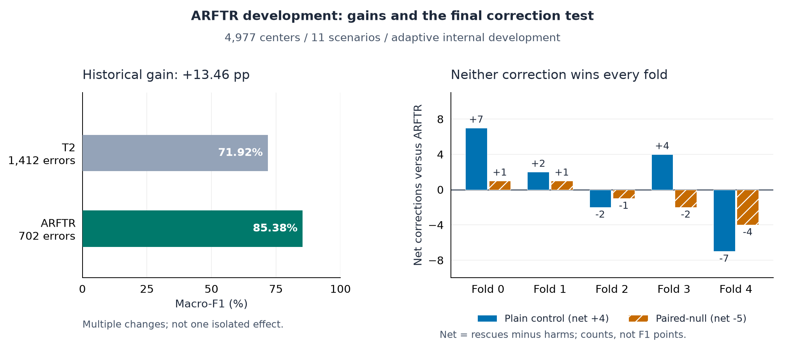

# Research history and follow-up experiments

This is the supporting research archive. For the retained architecture's mechanism,
original component study and results, start with the
[ARFTR architecture guide](ARCHITECTURE.md) and [project overview](../README.md).
The earlier studies and later corrections below provide context; they are not
additional parts of the retained ARFTR architecture.

Status: development search closed; retained result unchanged. Package version
`3.1.0.dev0` is an unreleased working revision, not a published release or DOI.

## Distinct evaluation tracks

| Track | Result | Evaluation boundary |
| --- | --- | --- |
| POLAR v1 | 94.0% macro-F1 | Source-audited four-class held-out test, 3,329 images |
| V-COCO v2 | 86.63% macro-F1 | Person-level official test, 6,077 people |
| Temporal v3 | 78.54% macro-F1 | Separate Okutama confirmation, 1,771 examples |
| ARFTR continuation | 85.383648% macro-F1 | Adaptive five-fold development, 4,977 centers / 11 scenarios |

These numbers are **not comparable rankings**: populations, labels, modalities and
selection histories differ. The [documentation index](README.md) links the original
reports for the first three tracks. The final track is backed by the
[portable metric export](../results/arftr_development/metrics.json).

## Where useful gains came from

The older studies provide controlled evidence worth preserving alongside the
continuation's negative results. Effects below are macro-F1 **percentage points**;
they concern different comparisons and must not be added together.

| Comparison | Change (95% paired interval) | What the evidence supports |
| --- | ---: | --- |
| V-COCO selected multiview stack versus best single-view DINO | +1.18 [+0.37, +2.01] | The combined system helped on development; not a view-only ablation |
| V-COCO factorized versus flat head, same features | +1.11 [+0.56, +1.66] | Separating posture and locomotion helped in the matched development comparison |
| Okutama temporal teacher versus matched static | +3.96 [+2.02, +5.68] | Temporal evidence improved the earlier sealed confirmation result |
| T2 to retained ARFTR | +13.46 historical change | Many interventions across adaptive development; no single-component attribution |

Sources: [V-COCO comparison lock](../results/vcoco_v2/final_selection_lock.json),
[temporal confirmation report](VCOCO_V3_MOTION_IDENTIFIABILITY.md), and
[ARFTR ledger](../results/arftr_development/experiment_ledger.csv).
The first two intervals resample source-image groups; the temporal interval resamples
scenarios. These controls support narrower claims than a raw score increase alone.

## What the continuation established

The saved earliest T2 result was 71.923768% macro-F1; retained ARFTR reached
85.383648%, a **+13.459880 percentage-point historical gain**. This is a sequence of
data/representation, evidence fusion, actor-memory and factor-residual changes,
not an isolated causal estimate of one invention. The consolidated result ledger
records the same development population and explicitly distinguishes raw,
routed, and post-hoc results.

ARFTR leaves 702 errors and remains the retained system. Later point estimates can
be slightly higher without satisfying acceptance criteria: the crossing verifier
reached 85.611648%, but its fold nets were +9, +2, -1, 0, 0. It was not promoted.
Additional RGB and motion correction trials likewise failed to establish a robust
improvement. “Retained” therefore does not mean “highest exploratory point estimate.”
The [original architecture review](HAC_NEXT_ARCHITECTURE_MAP_20260912.md) also notes
that ARFTR's last incremental gain did not pass its strict scenario-significance
screen. Retention is a documented development decision, not a claim of statistically
established superiority for every component.

## Final optional mechanism test

The final matched study compared a plain motion residual with a shared-head
reference subtraction trained from initialization:

`delta = 0.5 * tanh(h(a, b, g) - h(a, 0, g))`

Both arms used the same five folds, seed 42, data, ancestry-safe priors, minibatch
schedule, 256 updates, optimizer and training objective. The paired arm enforces
zero residual when the explicit difference carrier is zero. Ordered means and
geometry still carry temporal information; the reference is not motion-free.

| System | Macro-F1 | Errors | Rescue / harm versus ARFTR |
| --- | ---: | ---: | ---: |
| Retained ARFTR | 85.383648% | 702 | — |
| Matched plain control | 85.467181% | 698 | 40 / 36 |
| Trained paired-null | 85.311396% | 707 | 40 / 45 |

The new arm lost 0.072252 pp versus ARFTR; its 95% scenario-bootstrap interval was
[-0.279515, +0.148178] pp. Fold nets were +1, +1, -1, -2, -4. NLL and Brier worsened.
It failed the fixed continuation gates. This is a negative result for the tested
recipe, not proof that all future motion models are unhelpful.

The fold plot exposes the instability hidden by the plain control's slightly better
aggregate score. It shows counts, not fold macro-F1 or uncertainty estimates.
The [model card](MODEL_CARD.md) visualizes the retained system's residual errors.

Numerical-only control exceptions were approved before opening new outcome scores;
class predictions, inputs and provenance still had to match. All ten saved
checkpoint outputs subsequently replayed bit-for-bit after correcting the audit's
reference tensor memory layout. No checkpoint was retrained or selected. The
separately written replay was by the same author, not an independent-person audit.

## Claims and limits

- No oracle score is presented as deployable performance.
- Annotation-derived support categories are diagnostic-only, not routing inputs.
- No outer-held labels trained a correction router in the final study; no router
  was fitted at all.
- The development set was repeatedly reused. Confidence intervals do not remove
  adaptive-selection bias or establish deployment performance.
- The final matched test used one seed. Neither seed robustness nor a universal
  architecture ceiling has been established.
- The public aggregate replay verifies arithmetic and gates, not feature extraction,
  optimizer execution, or the full transitive ancestry of private caches.

The evidence supports closing this search cycle, preserving the successful system
and unsuccessful branches, and making the work reproducible. Reopening requires a
new justified protocol, not a retrospective threshold change.
